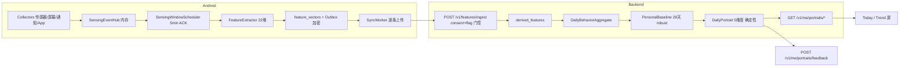

# ECHO Mind 仓库架构系统走读报告

> 走读对象：`/data/attachments/v1/ECHO Mind`（monorepo）
> 走读时间：本次会话 · 方式：目录层级系统走读 + 三路并行深读（backend / android / 基建治理）+ 关键发现逐一交叉验证
> 版本基线：v0.7.0 Portrait Core（pilot-candidate，尚未正式上线）
> 本报告定位：开发者/评审视角的全仓架构梳理 + 代码质量问题与改进点；不替代仓库自带的产品契约与交付文档。

---

## 0. 执行摘要（一页结论）

ECHO Mind 是一款「被动感知心理健康节奏记录」产品：Android 客户端在用户授权后采集加速度/陀螺仪/屏幕/通知/前台 App 信号，**端侧**提取 22 维行为特征（原始数据不落盘、不上云），经加密 Outbox 上传到 FastAPI 后端；后端按确定性流水线生成「今天的你 vs 通常的你」每日画像（Me vs Me），全程只做行为观察、不做心理诊断（产品契约 `PORTRAIT_CONTRACT.md` 冻结）。

**架构总评**：工程质量明显高于一般 MVP。隐私-by-construction（fail-closed 贯穿加密/开关/画像状态机/白名单）、Outbox 可靠同步 + 窗口 ACK 语义、append-only 审计哈希链 + 三层不可变保障、单一版本事实源、环境阻塞如实标记不伪造 PASS，都是可圈可点的设计。测试扎实：后端 pytest 1055 passed / 1 skipped，Android 297 项单测全绿，后端行覆盖率 93.8%。

**最需要警惕的问题**（详见 §8，全部已交叉验证）：

1. 🔴 Android 加密密钥 alias 升级（v1→v2）会改变 SQLCipher 派生口令 → 任何旧安装的加密数据库将无法解密，且代码注释仍宣称「现有用户口令不变」（自相矛盾）。
2. 🔴 用「固定全零 IV 的 AES-GCM + SHA-256」当口令派生 KDF（非标准做法），并为此放宽了 Keystore 密钥约束。
3. 🔴 发布元数据与代码现实系统性脱节：交付清单/发布说明/SBOM/试点总控表仍停留在 v0.2~v0.7 封板时点（测试数 1046、ruff/mypy 非零、Android NOT RUN），而当前 HEAD 实际为 1055 通过 / ruff 0 / mypy 0 / Android 297 绿。
4. 🟠 多处死代码：Android `SafetyEngine` 无任何生产调用方；`NarrativeProfileRepository`/`LegacyInputRepository` 纯占位；`EscalationRepository.refreshEscalationStatus` 服务端确认分支不可达。
5. 🟠 门禁体系有「空转」项：detekt 仅 4 条规则、instrumentation job 无测试时空通过、fault_injection 为静态 grep 断言。

**总体结论**：代码主链完整、测试充分、隐私约束贯彻一致；主要风险集中在「加密密钥演进兼容性」「元数据/文档与代码漂移」「个别门禁形同虚设」三类，均可通过明确行动项收敛（§9 改进路线图）。

---

## 1. 仓库全景

### 1.1 目录层级与规模

```
ECHO Mind/
├── android/          Kotlin + Compose 客户端（55 主源码 kt + 30 测试 ≈1.5 万行）
├── backend/          FastAPI 后端（app 8.4k 行 + alembic 1.3k 行 + tests 8.5k 行 ≈1.8 万行，124 个真实 .py）
├── docs/             文档：current/（当前事实）+ archive/（22 份历史）+ 契约/图
├── scripts/          发布与门禁脚本 14 个 + version_source.json（单一版本事实源）
├── content-packs/    内容包 4 个（practices / GAD-7 / PHQ-9 / L2 稳定化）+ 生成式 MANIFEST
├── pilot-pack/       机构试点治理模板 15 份（责任矩阵/PIPIA/危机演练/Go-NoGo…）
├── safety-eval/      合成红队语料 650 条 + 评估报告（accuracy 1.0）
├── .github/          3 条 CI workflow + dependabot
├── releases/         v0.2.0 打包产物（已过期，v0.7 未落此处）
├── .codebuddy/.trae/.workbuddy/   本地 AI 助手工作区（memory+specs，.gitignore 排除）
├── Makefile / docker-compose.yml / DELIVERY_MANIFEST.json / FILE_HASHES.sha256 / sbom.spdx.json
├── PORTRAIT_CONTRACT.md  产品最高契约（冻结 v1.0）
└── RELEASE_NOTES_v0.{2,6,7}.md
```

### 1.2 版本与状态

- 版本事实源：`scripts/version_source.json` → release 0.7.0 / backend 0.7.0 / Android versionName 0.7.0、versionCode 4。
- 产品状态：`pilot-candidate`（CODE-FROZEN 结论见 `docs/current/40_Delivery_Report_v0.7.md`）；外部发布门（真机构建、PG、渗透测试、机构审批、真实试点）未完成。
- 本环境限制（如实记录）：无 `git`、无系统 Python（`backend/.venv` 为 macOS arm64 uv 虚拟环境，软链指向 `/Users/panhao/...`）、无 JDK/SDK，故 pytest/gradle 无法在本机复跑；测试数字采信仓库自身交付报告与 `.workbuddy/memory/2026-08-13.md` 的实测记录并交叉核对。

### 1.3 产品主链（固定不变，来自 PORTRAIT_CONTRACT）

```
Passive Sensing → Derived Features → Daily Behavior Aggregate → Personal Baseline
→ Daily Portrait → Today → 7 / 28 Day Portrait Timeline
```

判据：任何新需求必须让「每天看见自己」更准确/可信/易懂，否则默认延期。核心原则：**Observation，不做 Psychological Interpretation**；Me vs Me（不比较人群均值）；允许 abstain（数据不足不硬生成）；画像维度取值禁止评价性命名。

---

## 2. 后端架构（backend/）

### 2.1 分层

```
API 层   app/api/*       路由 + 权限声明 + 审计触发（routes.py 聚合 12 个子 router）
契约层   app/schemas.py  Pydantic v2 出入参（extra="forbid" 拒绝原始传感 payload）
服务层   app/services/*  纯业务/统计/编排（portrait / baseline / aggregates / sandbox / 顶层）
模型层   app/models.py   SQLAlchemy ORM，27 张表
设施层   database / config / auth / request_context
```

设计原则：权限声明靠近 endpoint；写路径审计由路由层负责；GET 无写副作用；幂等优先（tenant+event_id / tenant+user+local_date）；隐私-by-construction。

### 2.2 入口与装配

| 文件 | 职责 |
|---|---|
| `app/main.py` | FastAPI 装配：lifespan（仅 local 环境 create_all，生产必须 Alembic）、CORS、安全头中间件（nosniff/DENY/no-referrer/no-store/Permissions-Policy）、X-Request-ID 传播、隐私安全遥测；`/health` `/ready` `/console`（人工接管工作台 HTML） |
| `app/config.py` | pydantic-settings；SLA 阈值（ack 60s / takeover 180s / org_lead 600s）、沙箱配额、激活码 TTL；`validate_production_secrets()` 拒绝弱密钥 |
| `app/database.py` | SQLite（check_same_thread=False, timeout=30）与 PG 双后端；内存库 StaticPool |
| `app/auth.py` | JWT HS256 + RBAC 八角色（user/on_call/professional/auditor/admin/quality_reviewer/security_auditor/vendor_support）；心理内容角色（user/professional）、只读角色、无数据角色三分 |
| `app/request_context.py` | ContextVar 传播 X-Request-ID，审计行与响应头一致 |

### 2.3 数据模型与迁移

27 张表，主线：租户/用户/同意（tenants/users/consents）→ 主动输入 legacy（checkins/journals/questionnaires/practices，v0.8 移除目标）→ 激活码（activation_codes/attempts）→ 危机处置（risk_signals/escalations）→ DSR → 派生特征（derived_features）→ 画像主链（daily_behavior_aggregates → personal_baselines → materialization_state → daily_portraits → portrait_feedback）→ 沙箱（skills/tools/sandbox_runs/tenant_slots）→ 审计（audit_events）。

Alembic 17 个迁移单链演进（20260729_0001 → 20260813_0001），**当前 head = `20260813_0001`（portrait_feedback）**；注意 `docs/current/README.md` 与 RELEASE_NOTES 仍写 head=20260812_0002（文档漂移）。

三层 append-only 保障：PG 触发器（0002 迁移）+ ORM `before_flush` 守卫（`services/immutability.py`，SQLite 回退）+ SHA-256 哈希链审计（`services/audit.py`：PG advisory xact lock / SQLite per-tenant RLock 串行化，`verify_audit_chain` 可校验）。

### 2.4 API 全景（57 路径）与 RBAC

共享依赖集中在 `app/api/deps.py`：`ensure_user`（租户隔离+本人校验+status）、`forbid`（拒绝即审计）、三类 consent 门控（412）、`require_feature_flag`（关→410，fail-closed）。

| 模块 | 核心端点 | 职责/鉴权 |
|---|---|---|
| onboarding | POST /tenants（Bootstrap-Key）、/users、/onboarding/l0、/emergency-contact、/verify-code | 激活码换 JWT（预认证，限流防爆破，响应不含 tenant_id/role/external_ref） |
| consent | POST /onboarding/consents、GET .../latest | 版本化同意证据链 |
| features | POST /features/ingest | **被动感知写入口**：consent+flag 门控 → 幂等入库 → 聚合 → 物化；不触发任何被动危机链 |
| portraits | GET /portraits/today、/portraits、/baseline/status；POST /portraits/rebuild；/me/* 变体；POST /me/portraits/feedback | 只读画像视图（GET 绝不写库）+ 显式重建 + LIKE/NOT_LIKE 反馈 |
| escalations | POST /escalations；GET 队列/metrics/sla-scan/{id}/case-review/user-status；POST ack/takeover/close/review | 危机处置状态机 + SLA 阶梯 + 用户侧最小状态（不泄露内部） |
| data_rights | POST/GET /data-subject-requests；POST .../{id}/complete | DSR + 分类删除矩阵（审计/危机记录依法保留） |
| skills | GET /skills（signed-only + 脱敏下发）、POST /skills/completions、POST /skills/{id}/transition | Skill 治理状态机 draft→reviewed→signed→retired |
| sandbox | POST /sandbox/runs、GET /sandbox/runs/{id} | 自进化沙箱调度/查询 |
| admin | GET /audit/events、/audit/verify、/config/flags、PUT /tenant/flags、/tenant/portrait、/admin/activation-codes、/skills/batch-retire | 审计校验、灰度回滚、机构去标识画像（cohort<5 suppression）、激活码管理 |
| legacy | POST checkins/journals/questionnaires/practices/safety → 410；DELETE/PATCH escalations/risk-signals/audit → 405（审计后拒绝） | 停用存根 + append-only 守卫 |

### 2.5 核心服务（关键函数）

**画像主链（v0.7 核心）**
- `aggregates/calculator.py::upsert_daily_aggregate` — 22 维向量按用户本地日窗口聚合（coverage 按 unique(window,schema,source)，DST 动态窗口数 276/288/300）。
- `baseline/calculator.py::build_baseline` — 近 28 天有效日（coverage≥0.25）weekday/weekend 分桶 robust 统计（median/MAD/p10-p90），<2 天 fallback all_days；`baseline_state`：0-2 WARMING_UP / 3-6 EARLY_BASELINE / ≥7 READY。
- `baseline/circular.py` — 圆周 median/MAD（active_start/end 跨午夜正确）。
- `portrait/engine.py::generate_portrait` — 编排：聚合 → 基线 → 状态机分流 → `compute_dimensions`（5 维度 + STABILITY，z=scale=max(mad·1.4826, IQR/2, 1e-6)，|z|≤0.7 SIMILAR，最小有意义绝对差防 near-zero 基线）→ `build_narrative`（确定性中文模板 + ≤3 两字 headline）→ `build_facts`（可解释事实，禁止原始指标与 +900%）。
- `portrait/materializer.py` — DB-backed dirty 状态机：mark_dirty → 15 分钟 debounce → 原子 claim（`UPDATE...WHERE dirty=true`）→ 失败恢复 dirty 重试；晚到日期立即物化。
- `schema_registry.py` — 特征 schema 单一事实源（passive-core-v1 22 维 aggregate_eligible；mic-feature-v1 256 维外围）。

**安全与治理**
- `audit.py::append_audit` — 哈希链（previous_event_hash → event_hash），occurred_at 严格递增。
- `escalation.py::scan_sla_breaches` — 未 ack 阶梯：60s 通知第二值班 → 180s 机构负责人 → 600s 链失效；通知≠接管。
- `activation.py::redeem_code` — 哈希存储、TTL、原子一次性消费（UPDATE...WHERE used_at IS NULL）、三维 rate limit。
- `sandbox/runner.py::SandboxRunner.execute` — 子进程隔离 + join(timeout) 真超时 terminate/kill + 租户执行槽原子配额；回路 audit_day→find_gaps→forge_tools→validate_tools→induct_skills（模板确定性锻造，非 LLM）。
- `crypto.py` — AES-GCM 字段加密，AAD 绑定 `tenant:user:field`。
- `feature_flags.py` — fail-closed：隐私敏感开关未知/缺失一律 false。
- `telemetry.py` — 只记 method/path/status/duration 等非敏感字段。

### 2.6 数据流

```
Android 22 维特征 → POST /features/ingest（consent+flag 门控，extra=forbid）
→ derived_features（幂等 tenant+event_id）
→ upsert_daily_aggregate（本地日界线聚合）→ mark_dirty
→ materialize_dirty（独立事务：build_baseline → generate_portrait）→ daily_portraits
→ GET /me/portraits/today | /me/portraits?days=7|28 | /me/baseline/status（只读，无写副作用）
→ POST /me/portraits/feedback（LIKE/NOT_LIKE）
```

### 2.7 测试组织

42 个测试文件，`fastapi.testclient.TestClient` 集成测试为主；conftest 内存 SQLite + marker 区分 sqlite_only/postgres_only；覆盖安全/RBAC/不可变/DSR 矩阵/画像 E2E 与 golden fixtures/沙箱并发隔离/Skill signed-only/激活码/SLA/契约 fixtures。当前实测：1055 passed / 1 skipped。

---

## 3. Android 架构（android/）

### 3.1 装配（手动 DI，无框架）

`EchoMindApplication`（`by lazy { AppContainer }` + WorkManager Configuration.Provider）→ `MainActivity`（唯一 Activity）→ `EchoMindApp`（Compose 根）。`AppContainer` 集中装配：cipher（AndroidKeystoreFieldCipher，fail-closed）→ prefs（SharedPreferences + DataStore）→ SQLCipher 全库加密 Room v7（SQLCipher 加载失败即抛异常，绝不回退明文）→ ApiClient → Outbox → 10 个仓库 → SkillSessionCoordinator → Collector/调度器工厂。无 Hilt/Koin、无 Navigation Compose、无 ViewModel。

### 3.2 数据层（Offline-first）

- Room v7：10 实体（4 张 legacy 主动输入表 + outbox_events + consents + feature_vectors + active_skill_sessions + escalation_requests + portrait_daily）+ 4 DAO；迁移 1→2 … 6→7 六个（3→4 DROP sensor_samples 兑现「原始数据不落盘」）；schema 只导出 2/6/7.json。
- `Outbox`：跨域加密写入原语（eventId/eventType/payloadCiphertext/priority）。
- `SyncWorker`：逐条上传状态机 — 2xx/409 删、410+deprecated 删+迁移遥测、410+非 deprecated dead-letter、429/5xx 重试（Retry-After 聚合参与退避）、401/403 暂停（authRequired，避免高频重试）、412/422 保留、attempts≥10 dead-letter；derived_feature 20 条/分钟滑动限速。
- `PortraitRepository`：缓存优先+后台刷新+九态状态机；缓存键用服务器 local_date；PortraitDao 全部查询 SQL 层带 userId（用户隔离）。

### 3.3 感知管线（重点）

```
Sensor/Notification/Screen/AppActivity Collector → SensingEventHub（5 个 ConcurrentLinkedDeque 内存缓冲）
→ SensingWindowScheduler（5 分钟对齐窗口；不可变快照 + ACK 语义 + bounded retry≤3 + 去重）
→ FeatureExtractor.extractFromSnapshot（纯函数：22 维向量 + 中文摘要 + sources_present；跨窗口 carry-over）
→ SensingRepository.saveDerivedFeatures（withTransaction 落 feature_vectors + outbox 加密入队）
→ 成功才 clearConsumed（ACK）→ SyncWorker.enqueue
```

- `PassiveSensingService`：前台服务（specialUse）；三重门控（flag + consent + 核心传感器，全部 fail-closed）；拒绝通知使用权/使用情况访问/麦克风只降级覆盖度，不停止核心采集。
- `MicCollector`/`MicFeatureExtractor`：可选麦克风模块（默认关），原始音频即时处理即弃，256 维特征以 mic-feature-v1 上传（不进入画像聚合）。
- `ServiceRevocationCoordinator`：撤回/重开被动感知的唯一领域协调器（先写同意证据 → 停服务 → 清缓冲 → consent(false) 入 outbox）。
- 撤回路径：hub.clearAll() 保证「后续零新特征」。

### 3.4 安全

- `SafetyEngine`：确定性正则规则包（EXIT/RED/YELLOW + 否定词守卫；被动红词已删除）——**当前无生产调用方**（主动文本 UI 已停用）。
- `AndroidKeystoreFieldCipher`：AES-GCM 字段加密（Keystore 不可用 fail-closed）+ `deriveDatabasePassphrase()` 派生 SQLCipher 口令（实现见 §8 问题 1/2）。
- fail-closed 贯穿：SQLCipher 加载失败抛异常、flag 无缓存默认 false、画像未知 status→ERROR、Skill action_type 白名单外不渲染。

### 3.5 UI

4 Tab（今天/能力/趋势/支持）+ 紧急支持 FAB 常驻；`rememberSaveable` 导航态；六步 Onboarding（WELCOME→PORTRAIT EXPLANATION→CORE DATA CONSENT→MINIMUM SENSING→BASELINE WARMING UP→DONE）；Today 九态渲染 + LIKE/NOT_LIKE 反馈（本地即时 + Outbox）；Skill 卡片宿主 + `SkillSessionCoordinator`（Mutex 串行、single-active、进程死亡恢复、时长按 liveDurationSeconds 结算）。

### 3.6 线程模型

Main（UI + startForeground + 传感器回调默认主线程）；Dispatchers.Default（sensingScope：门控/调度循环/mic start）；Dispatchers.IO（UsageStats 轮询、录音循环、仓库网络调用）；WorkManager（SyncWorker）；Room 自有 dispatcher + withTransaction；并发原语：ConcurrentLinkedDeque（无锁）、Mutex（Skill 协调器）、@Volatile（口令缓存）。

### 3.7 测试

30 个测试文件约 297 用例：特征提取/窗口 ACK/同步状态机/画像契约（与后端同源 JSON fixtures）/Skill 状态机/DB 迁移/安全规则/E2E 转换。盲区：无 androidTest（instrumentation 空转）、无真实 HTTP 集成、迁移仅验 v3→v4。

---

## 4. 端到端调用链（跨端）



同步契约：`docs/contract-manifest.json`（18 required endpoints + 字段枚举 + 语义契约，`contract_drift_check.py` 断言漂移即 CI 失败）。

---

## 5. 基建与治理

### 5.1 CI/CD

- backend-ci（7 job）：ruff+mypy 硬门禁 / SQLite 测试 / PG 测试+coverage≥70 / alembic roundtrip / 静态检查 / openapi-drift / contract-drift+fault-injection。
- android-ci（2 job）：unit-lint（testDebugUnitTest+assembleDebug+lintDebug+detekt）/ connected-test（API 34/36 矩阵，androidTest 为空时「空通过」）。
- security-ci：TruffleHog / SBOM / CodeQL(python) / dependency-review / pip-audit / osv-scanner / trivy；每周一 cron。
- 发布流水线：`make preflight`（release_preflight.sh 7 段）→ `make package`（package_release.sh：hash 校验 + zip/tar/bundle + 产物哈希）。

### 5.2 脚本层（14 个）

门禁性质分类：硬门禁（contract_drift、fault_injection、safety_eval、validate_content_packs、claim_scan、check_dynamic_code）/ 生成（update_release_metadata、generate_sbom）/ 打包（package_release）/ 冒烟（smoke）/ 游离（backup_restore_drill、android_release_static_check 未接入任何入口）。

### 5.3 文档体系与治理资产

- `docs/current/` 当前事实索引；`docs/archive/` 22 份历史；`docs/openapi.json`（57 路径）；`docs/contract-manifest.json`。
- content-packs 4 包（其中 2 包 `draft_requires_clinical_review`）；pilot-pack 15 份治理模板；safety-eval 650 条语料评估 accuracy 1.0。
- `.workbuddy/memory/` 逐日记录是判断「文档 vs 代码实际状态」的最可靠旁证（v0.7 封板后 7 个提交：反馈端点补齐、Skill 时长修复、ruff/mypy 清零、LocalRepository 拆分、Android 首编译绿、真机闪退修复）。

---

## 6. 代码质量优点（值得保留的设计）

1. **隐私-by-construction**：原始数据不落盘不上云（3→4 迁移 DROP sensor_samples 兑现承诺）；上云仅 22 维摘要+向量（无包名、无通知内容）；fail-closed 贯穿加密/开关/画像状态机/白名单。
2. **Outbox + ACK 窗口语义**：先持久化成功再清缓冲、失败重处理同一不可变快照，消除静默丢失；同步状态机覆盖 401/403/412/422/429/410/毒丸全分支。
3. **审计哈希链三层保障**：PG 触发器 + ORM 守卫 + SHA-256 链（可校验），并发 append 串行化防分叉。
4. **确定性画像流水线**：纯函数统计 + 模板文案 + baseline_snapshot_digest 可复现；「missing != irregular」「minimum meaningful delta」等统计陷阱有意识地修正过。
5. **契约驱动**：跨端契约 manifest + 同源 JSON fixtures + 漂移检查 CI；版本单一事实源 + test_version_consistency。
6. **工程诚实度**：环境阻塞如实标记 NOT RUN/ENVIRONMENT BLOCKED，不伪造 PASS；测试数从 junit XML 解析而非硬编码。

---

## 7. 代码质量问题清单（全部经走读验证）

> 严重度：🔴 高（数据安全/发布阻断） / 🟠 中（正确性/一致性） / 🟡 低（可维护性）
> 来源标注：〔B〕backend 深读 〔A〕android 深读 〔I〕基建深读 〔V〕本报告主走读复核

### 7.1 安全与加密

| # | 严重度 | 位置 | 问题 |
|---|---|---|---|
| 1 | 🔴 | `android/.../security/AndroidKeystoreFieldCipher.kt:35,28-29` | 密钥 alias v1→v2 强制重建（真机闪退修复），派生 SQLCipher 口令随之改变 → **旧安装的加密库无法解密（数据不可读）**；注释仍宣称「现有用户数据库口令不变」，自相矛盾。试点若有存量数据将丢失。 |
| 2 | 🔴 | `AndroidKeystoreFieldCipher.kt:91-101,62` | 用固定全零 IV 的 AES-GCM 加密固定盐再 SHA-256 派生口令（非标准 KDF）；为此 `setRandomizedEncryptionRequired(false)` 放宽密钥约束。建议改 HKDF/HMAC-SHA256，并为「字段加密」「口令派生」分设密钥。 |
| 3 | 🔴 | `backend/app/config.py:12,17-18` + docker-compose 默认值 | 弱默认密钥硬编码（dev-secret/bootstrap/field-encryption）。有 `validate_production_secrets()` 兜底，但默认值留在源码，任何漏配环境的防护依赖该兜底不被绕过。 |
| 4 | 🟠 | `backend/app/services/crypto.py:37-39`；`config.py:37-39`；`activation.py:56-60` | 密钥/pepper 派生用裸 SHA-256 而非 KDF/HMAC（字段加密密钥 = sha256(secret)；激活码 pepper = sha256(bootstrap:activation:code)）。 |
| 5 | 🟠 | `backend/alembic/versions/20260729_0001_path_a_v02.py:20` | 基线迁移用 `Base.metadata.create_all`，schema 随 models 漂移，新库/旧库演进语义分裂（后续迁移被迫大量 inspector 幂等跳过）。 |
| 6 | 🟠 | `backend/app/models.py` 多表 | 大量 `tenant_id` 无 FK 外键（consents/risk_signals/escalations/derived_features/daily_portraits 等），租户隔离仅靠应用层 `ensure_user`。 |
| 7 | 🟠 | `backend/app/services/activation.py:192-195` | 注释称「未知码不写 attempt（避免索引热点）」但实际调用 `_record_attempt` 写入失败行——注释与实现矛盾；任意猜测码可放大 `activation_attempts` 写入（DoS 面）。 |
| 8 | 🟡 | `android/.../AppPreferences.kt:16-22,35-46` | userId/institutionCode 明文存 SharedPreferences；narrative/skill 缓存明文。 |

### 7.2 正确性与并发

| # | 严重度 | 位置 | 问题 |
|---|---|---|---|
| 9 | 🟠 | `android/.../sensing/SensingEventHub.kt:121-127` | `clearConsumed` 按值相等 `remove`，data class 字段相同的样本会被一次清两条，破坏 ACK 精确性。建议引用/序号移除。 |
| 10 | 🟠 | `backend/app/api/features.py:69` vs `:81-88` | 日界线口径不一致：叙事用 `window_start.date()`（UTC 日期），聚合用用户本地时区；跨日线用户叙事日期与聚合日期错位。 |
| 11 | 🟠 | `backend/app/api/escalations.py:141-147` | `X-Total-Filtered` 报未过滤总数，分页语义误导。 |
| 12 | 🟠 | `backend/app/api/escalations.py:208-215` | metrics 全量载入 Python 算 P50/P95（代码自注 TODO 下推 SQL），表增长后内存风险。 |
| 13 | 🟡 | `backend/app/services/audit.py:28,32-38` | `_tenant_locks` dict 无界增长（每租户一个 RLock 永不清理）。 |
| 14 | 🟡 | `backend/app/services/sandbox/slots.py:76-77` | INSERT 冲突时 `db.rollback()` 会回滚外层事务其它写操作；建议 `begin_nested` SAVEPOINT。 |
| 15 | 🟡 | `android/.../SensorCollector.kt` | 传感器回调跑主线程（未传 handler），长期 200ms 频率有 jank 风险。 |
| 16 | 🟡 | `android/.../OnboardingScreen.kt:320-340` | 打开系统授权页后乐观置 authorized=true，未校验真实返回；通知授权判定在 `PassiveSensingService.kt:251` 与 `SensingCapabilities.kt:101` 重复实现。 |

### 7.3 死代码与不可达分支

| # | 严重度 | 位置 | 问题 |
|---|---|---|---|
| 17 | 🟠 | `android/.../security/SafetyEngine.kt` | `evaluate()` 无任何生产调用方（仅测试引用）；`SensingRepository.passiveSafety` 同样无消费方。 |
| 18 | 🟠 | `android/.../data/NarrativeProfileRepository.kt`、`LegacyInputRepository.kt` | AppContainer 装配但全仓无调用点，连同 4 张 legacy 表纯占体积（v0.8 清理目标）。 |
| 19 | 🟡 | `android/.../data/EscalationRepository.kt:107-117` | `refreshEscalationStatus` 无调用方，服务端 ack/takeover 分支不可达，用户侧状态长期停留在本地乐观值。 |
| 20 | 🟡 | `backend/app/services/telemetry.py:57-67` | `count_event/snapshot_counts` 进程内存计数器无导出/落盘，多 worker 下不可聚合，形同半成品。 |

### 7.4 元数据与文档一致性（发布阻断风险）

| # | 严重度 | 位置 | 问题 |
|---|---|---|---|
| 21 | 🔴 | `DELIVERY_MANIFEST.json` / `RELEASE_NOTES_v0.7.0.md` / `docs/current/40_Delivery_Report_v0.7.md` / `sbom.spdx.json` / `pilot-pack/00_试点就绪总控表.md` | 发布元数据整体过期：MANIFEST 1046（实际 1055 passed/1 skipped）；RELEASE_NOTES 自述 ruff 16/mypy 40/Android NOT RUN（实际 ruff 0/mypy 0/Android 297 绿）；40_Delivery_Report 写 ruff 17 与 release notes 16 互相矛盾；SBOM name/namespace 硬编码 v0.2.0；试点总控表仍是 v0.2/781 测试。根因：封板后 7 个提交未重生成元数据。 |
| 22 | 🟠 | `docs/current/README.md` / `RELEASE_NOTES_v0.7.0.md` | Alembic head 写 20260812_0002，实际 20260813_0001；README「1056 项全绿」实为 1055 passed + 1 skipped。 |
| 23 | 🟠 | `docs/01_PRD.md`、`docs/class-diagram.mermaid`、`docs/sequence-diagram.mermaid`、`docs/current/41_*` | PRD 仍写已移除的被动 RED 升级链路与旧 /v1/portraits/* API；类图/时序图为 v0.6 叙事链；41 拆分设计自称「纯设计」但代码已落地拆分。 |
| 24 | 🟠 | `backend-ci.yml` vs `release_preflight.sh` | CI 把 ruff/mypy 当硬门禁（裸 run），本地 preflight 降级为「PASS WITH WARNINGS」；冻结态文档自认 16-40 条错误——文档与门禁结论不自洽（当前代码已清零，但文档未回写）。 |

### 7.5 工程基建

| # | 严重度 | 位置 | 问题 |
|---|---|---|---|
| 25 | 🟠 | `android/detekt.yml` | buildUponDefaultConfig=false + naming 全关，仅 4 条规则，SAST 形同虚设。 |
| 26 | 🟠 | `android-ci.yml` connected-test | androidTest 为空时「无测试」空通过，instrumentation 门禁空转（真机闪退正是单测+lint+构建全绿后爆发）。 |
| 27 | 🟠 | 三 workflow | Actions 全 pin major tag（自注 TODO pin commit SHA），供应链风险未闭环。 |
| 28 | 🟠 | `scripts/package_release.sh` | VERSION 硬编码 "0.7.0"，绕过 version_source.json（历史曾硬编码 0.2.0 踩坑）。 |
| 29 | 🟡 | `scripts/fault_injection_check.py`、`check_dynamic_code.py`、`claim_scan.py` | 静态 grep 式断言/正则黑名单，易绕过，非运行时验证。 |
| 30 | 🟡 | `scripts/smoke.sh`、`validate_content_packs.py`、游离脚本 | smoke 仍打已 410 的 /v1/checkins；内容包校验带写副作用；backup_restore_drill/android_release_static_check 未接入任何入口。 |
| 31 | 🟡 | `android/local.properties` | sdk.dir=/tmp/echo-build/tools/sdk 环境残留入库；backend/.venv 指向 macOS 绝对路径（本机不可用）。 |

### 7.6 架构与可维护性

| # | 严重度 | 位置 | 问题 |
|---|---|---|---|
| 32 | 🟠 | `android/.../ui/*` | 无 ViewModel：`collectAsState()`（非 WithLifecycle）+ 组合中同步读 SharedPreferences；后台/旋转时状态生命周期管理薄弱；lifecycle-viewmodel-compose 依赖未使用。 |
| 33 | 🟡 | `backend/app/api/data_rights.py:217` | `__import__("datetime")` 内联动态导入（突兀且破坏静态分析友好度，features/escalations/admin 亦有函数内联 import）。 |
| 34 | 🟡 | `android/.../AppPreferences.kt` | 单类 30+ 键大杂烩（token/onboarding 七态/同步语义/dead-letter/retry-after/flag），apply()/commit() 混用；建议按领域拆分。 |
| 35 | 🟡 | UI 文案 | 大量中文硬编码在 Composable 而非 strings.xml，不利于 i18n 与无障碍审计；`POST_NOTIFICATIONS` 声明但从未运行时请求。 |

---

## 8. 改进路线图（建议优先级）

**P0 — 发布前必须**
1. 修复或明确化 Keystore alias 升级的旧库兼容策略（问题 1/2）：若确有存量试点数据，实现旧密钥解密+迁移；至少修正自相矛盾注释；口令派生改 HKDF/HMAC。
2. 以当前 HEAD 为准重跑 `update_release_metadata.py` + `generate_sbom.py`（去 v0.2.0 硬编码），回写 DELIVERY_MANIFEST / RELEASE_NOTES / 40_Delivery_Report / pilot-pack/00 总控表（问题 21/22）。
3. 决定 ruff/mypy 的 CI 语义：保持硬门禁（当前已清零，可锁基线）或显式豁免历史债务，消除文档矛盾（问题 24）。
4. Actions pin commit SHA（问题 27）。

**P1 — 试点前建议**
5. 删除或接线死代码（问题 17/18/19/20），并接线 `refreshEscalationStatus` 让人工支持「服务端确认」闭环真实可达。
6. 补 androidTest instrumentation 并让 connected-test 真正执行（问题 26）；detekt 启用默认规则集+baseline（问题 25）。
7. 后端 tenant_id 补 FK 或数据库层断言（问题 6）；激活码未知码写 attempt 的注释/实现对齐并加写入限流（问题 7）。
8. 修复日界线口径（问题 10）、X-Total-Filtered（问题 11）、metrics SQL 下推（问题 12）。

**P2 — 打磨**
9. UI 引入 ViewModel + collectAsStateWithLifecycle（问题 32）；AppPreferences 按领域拆分（问题 34）；文案进 strings.xml（问题 35）。
10. 门禁脚本接线（问题 29/30）；`package_release.sh` 读版本事实源（问题 28）；local.properties/venv 路径清理（问题 31）。
11. 基线迁移固化 DDL（问题 5）；审计锁/计数器资源清理（问题 13/14）；`__import__` 清理（问题 33）。

---

## 9. 走读方法、证据与限制

- **方法**：根目录逐层盘点 → 亲读两端全部核心入口/模型/服务/管线 → 三路并行子代理深读（backend / android / 基建治理，各自产出独立报告存档于 `/tmp/echo-review/*.md`）→ 对每个 🔴/🟠 发现逐一复核代码 → 交叉核对仓库自带的 Phase 0 审计、交付报告与 `.workbuddy/memory/2026-08-13.md` 演进记录。
- **已验证的关键事实**：Keystore v2 alias 与固定 IV KDF（亲读确认）；SafetyEngine 无调用方（全仓 grep 确认）；detekt 仅 4 条规则（亲读确认）；基线迁移 create_all（亲读确认）；activation 注释/实现矛盾（亲读确认）；数据层 27 表/17 迁移/head=20260813_0001（亲数确认）；测试数 1055/1 与 ruff/mypy 清零（采信 2026-08-13 memory 实测记录，与交付文档的旧数字形成对照）。
- **环境限制（如实记录）**：本机无 `git`、无系统 Python、无 JDK/SDK；`backend/.venv` 为 macOS 虚拟环境不可复用，故 pytest/gradle 未在本机复跑。测试数字与「Android 297 绿」采信仓库内多份互相印证的实测记录，而非本机执行结果。

---

*报告完。本报告为走读快照，与仓库自带文档（PORTRAIT_CONTRACT / docs/current / RELEASE_NOTES）不一致处以代码为准，已在 §7.4 逐项标注。*
