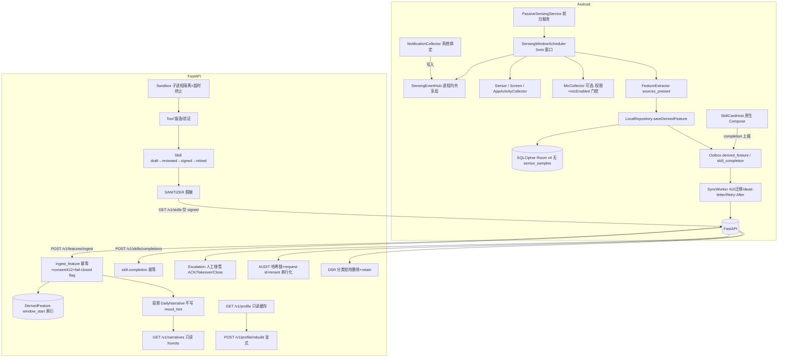

# 架构与数据流（v0.6）

> 版本：**v0.6.0**（被动感知 + 自进化 Skill + 人工安全链路）
> 基线：`main`（v0.6 收口迭代已实现：后端 874 passed；Android 32 文件改动完成）
> 本文档为**当前实现态**架构总览；逐环走读证据见 `docs/02a_真实调用链走读_v0.6.md`，增量收口设计与任务分解见 `docs/02b_架构收口设计_v0.6.md`，时序图/类图见 `docs/sequence-diagram.mermaid`、`docs/class-diagram.mermaid`。本文档不重复证据，只做总览，避免第三套事实源。

---

## 0. 范式总览

v0.6 采用**被动感知范式**：端侧采集传感器/屏幕/通知/App 活跃（可选麦克风）派生特征 → 上行 → 后端投影画像/叙事 → 自进化沙箱锻造 Tool 并归纳 Skill → 人工评审后仅 **signed** Skill 脱敏下发 → 用户在原生 Compose 卡片执行并上报完成。

**旧主动输入范式（Check-in / Journal / Questionnaire / Practice）已废弃**：后端对应写入口全部返回 410 Gone，Android 已移除主动录入入口；历史数据仅保留为只读记录（journals GET 可查），不再产生新的主动内容数据。

```
Android App
  ├─ Onboarding / Consent / L0（准入）
  ├─ 被动采集：Sensor / Screen / Notification / AppActivity / Mic(可选)
  ├─ SensingEventHub（进程内共享层）
  ├─ SensingWindowScheduler（5 分钟窗口）
  ├─ FeatureExtractor（sources_present）
  ├─ LocalRepository.saveDerivedFeature（安全评估 + 落库 + Outbox）
  ├─ SQLCipher Room v4（无 sensor_samples）
  ├─ SyncWorker（410 迁移 / dead-letter / Retry-After）
  ├─ Skill 卡片（WebView 沙箱渲染 + 原生 Compose 执行 + completion 上报）
  └─ SafetyEngine（确定性规则，仅本地文本/主动信号）
          │ TLS + JWT + X-Request-ID + 幂等 event_id
          ▼
FastAPI Gateway（fail-closed feature flag + consent 412 + 幂等）
  ├─ POST /v1/features/ingest → DerivedFeature(索引) → 投影 DailyNarrative
  ├─ GET /v1/narratives?from=&to=（只读批量）
  ├─ GET /v1/profile/{id}（只读缓存）/ POST /v1/profile/{id}/rebuild（显式）
  ├─ Sandbox（子进程隔离 + 超时终止）→ Tool → Skill(draft→reviewed→signed→retired)
  ├─ Sanitizer → GET /v1/skills（仅 signed）
  ├─ POST /v1/skills/completions（执行反馈）
  ├─ Escalation / 人工接管（ACK/Takeover/Close/Review）
  ├─ Audit（追加式哈希链 + request-id + tenant 串行化）
  └─ DSR（分类矩阵删除 + retain 语义）
          │
          ├─ PostgreSQL（生产） / SQLite（本地）
          └─ Clinician Console（只读工作台）
```

---

## 1. 新架构树（真实调用链）



---

## 2. 数据流（逐环节点）

### 2.1 端侧采集 → 特征
- `PassiveSensingService`（前台服务）启动后由 `SensingWindowScheduler` 每 **5 分钟**（`FeatureExtractor.WINDOW_DURATION_MS`）执行一次窗口 flush。
- `NotificationCollector`（系统绑定 NotificationListenerService）把 `timestamp + packageName + category`（**不含正文/标题**）写入进程内共享层 `SensingEventHub`；`FeatureExtractor.extractFromHub` 消费窗口快照。
- 可选 `MicCollector`：AudioRecord 16kHz 单声道，100ms 块即时 `MicFeatureExtractor` 提取后原始音频清零，派生特征经 `snapshotAndClear()` 消费为 `source="mic_opt"` 输入；受 `RECORD_AUDIO` 权限 + `micEnabled` 双门控。
- `FeatureExtractor` 产出 `DerivedFeatureInput(schema_version="feat-v1", source, sources_present, window_start/end, summary≤4000, vector≤256)`——`sources_present` 记录窗口内实际存在的信号源集合（修复单一 source 与 gap_finder 契约错位）。

### 2.2 落库 → Outbox → 上行
- `LocalRepository.saveDerivedFeature`：`feature_vectors` 落库（summary 字段加密，SQLCipher 全库加密）→ outbox `derived_feature`（priority=20）→ `SafetyEngine.evaluatePassive`（本地确定性红词，仅 UI 提示，**不再产生上行危机事件**，见 §4）。
- `SyncWorker`（unique work）按 priority 顺序上行；**410 处理**：deprecated 事件类型（checkin/journal/questionnaire:*/practice）→ 删除 outbox（terminal）+ 迁移 telemetry；非 deprecated 410 → dead-letter；429 → 读取 `Retry-After` 返回 retry；超限/解密失败 → dead-letter 不阻塞队列。

### 2.3 后端摄入 → 投影
- `POST /v1/features/ingest`：`require_feature_flag("passive_sensing_enabled")`（**fail-closed**）→ `ensure_user` → `require_passive_sensing_consent`（412）→ `source=="mic_opt"` 时额外 `require_voice_features_consent`（412）→ 按 `tenant_id+event_id` 幂等落 `DerivedFeature` → **投影 DailyNarrative**（事件列表；`mood_hint` 不再写入，列保留置空兼容历史）。
- **ingest 不触发任何被动 RED 危机链路**（`evaluate_passive` 不再被生产路由调用）：不创建 RiskSignal/Escalation，`escalation_id` 恒为 None——危机信号仅来自主动求助（见 §4）。
- `GET /v1/narratives?from=&to=`：只读批量，返回 ordered narratives + data coverage + missing dates（无读副作用）。
- `GET /v1/profile/{user_id}`：只读缓存；未构建时 404 并引导 `POST /v1/profile/{user_id}/rebuild`（显式重建 traits + version+1 + rebuilt_at）。

### 2.4 自进化沙箱 → Skill
- `POST /v1/sandbox/runs`：`sandbox_enabled` fail-closed flag + 速率 10/h + 并发槽（**覆盖整个执行期**）→ **子进程隔离执行**（`services/sandbox/worker.py`，独立 DB Session，真超时终止，rlimit 资源配额）。
- 回路：`audit_day → find_gaps（EXPECTED_SOURCES 5 源，配合 sources_present）→ forge_tools → validate_tools（静态校验+红词检查）→ induct_skills（status=draft, content_hash 幂等）`。
- 人工治理状态机：`draft → reviewed → signed → retired`（不可跳级/逆转）；**仅 signed 下发**；retire 经 transition/batch-retire 生效，客户端以拉取过滤 + 1h 缓存 TTL 收敛。

### 2.5 Skill 下发 → 用户执行 → 反馈
- `GET /v1/skills`：仅 `status=="signed"`，经 `sanitizer` 脱敏（移除原始特征引用/内部 ID/SandboxRun 引用），响应 `{skills, cold_start_hint, observation_days}`。
- Android `SkillCardHost`：WebView 安全沙箱渲染（禁 JS/文件/DOM 存储，HTML 转义），"开始"为原生 Compose Button；用户执行后经 `LocalRepository.recordSkillCompletion` → outbox `skill_completion` → `POST /v1/skills/completions`（幂等、校验 skill 归属 + signed 状态、audit `skill.completion`）。

### 2.6 人工安全链路与审计
- 主动信号（L0 准入 / help_requested / 文本红 / PHQ-9 高危项）→ `Escalation`（L3）→ `delivery_confirmed`（服务端已接收）→ SLA 扫描升级（第二值班人 → 机构负责人 → chain_broken）→ 人工 `ack → takeover → close（必填接管记录）→ review`。
- 审计：追加式哈希链（`previous_event_hash → event_hash`），`immutability` ORM 守卫 + DB 触发器双保险；写操作自动携带 `X-Request-ID`（contextvar）；tenant-scoped 串行化（PostgreSQL advisory lock / SQLite per-tenant RLock）防并发分叉。

---

## 3. 数据存储

| 层 | 存储 | 说明 |
|---|---|---|
| Android | SQLCipher Room **v4** | `feature_vectors`（summary 加密 + vector JSON）/ `consents` / `outbox_events` / 历史 checkins/journals/questionnaires/practices（只读）；**`sensor_samples` 已由 `MIGRATION_3_4` DROP**（落实"原始数据不落盘"）；全库加密口令由 Keystore 派生，不硬编码 |
| Android | SharedPreferences | 只读 Skill 缓存（1h TTL）、feature flags 缓存、sync telemetry/dead-letter 记录 |
| Backend | PostgreSQL（生产）/ SQLite（本地） | alembic 链至 `20260810_0001_v06_skill_contract`；`DerivedFeature` 复合索引 `(tenant_id, user_id, window_start)`；敏感字段 AES-256-GCM（AAD=tenant:user:field） |
| Backend | Audit | 追加式哈希链，依法永久保留 |

---

## 4. 安全边界

- **只有服务端 ACK 后才能显示"人工已收到"**：`delivery_confirmed`（系统确认接收）≠ `human_acknowledged`（人工 ack/takeover）；用户侧仅暴露送达确认与接管状态，内部升级细节不外泄。
- **危机信号仅来自主动求助**：L0 准入（current_danger / psychosis_or_mania / substance_impairment）、`help_requested`、主动文本红词、PHQ-9 高危题项等主动信号才创建 Escalation；**被动派生数据不触发危机链路**（ingest 不再调用 `evaluate_passive` 生产路由），不创建 RiskSignal/Escalation。
- **被动数据不推断情绪/自杀意图**：`mood_hint` / `recent_mood_hint` 不再由被动数据写入（DailyNarrative 列保留置空兼容历史）；趋势视图为定性标签而非情绪评分；不输出诊断或治疗建议。
- **fail-closed feature flag**：隐私敏感 flag（`passive_sensing_enabled` / `sandbox_enabled`）在未知 key、无缓存、网络失败时一律 **false**（不采集、不跑沙箱）；`skills_delivery_enabled` 非隐私敏感可默认 true。
- **Consent 门控**：端侧启动前置（onboarding consent + 本地开关 + 权限）；服务端 ingest 前置（`passive_sensing` consent 412；`mic_opt` 另需 `voice_features` consent 412）；撤回即 412。
- **Skill 治理**：`draft→reviewed→signed→retired` 不可跳级/逆转；**仅 signed 下发**；retire 后拉取即失效；下发前 sanitizer 脱敏。
- **只读无副作用**：GET 端点不写库/不 version+1；画像重建走显式 `POST /rebuild`。
- **沙箱隔离**：子进程执行 + 真超时终止 + 并发/速率配额 + rlimit；沙箱产物仅 draft 状态，需人工评审。
- **审计不可变**：RiskSignal / AuditEvent / Escalation 事实字段 append-only，ORM 守卫 + DB 触发器；DSR 删除不触碰审计链。
- **DSR retain 语义**：delete 按分类矩阵删除（derived_features / daily_narratives / user_profiles / checkins / journal_entries / questionnaire_results / practice_completions / emergency_contacts / tools / skills / sandbox_runs）；**依法保留** consents（同意/撤回证据链）、risk_signals（危机处置 append-only）、audit_events（哈希链永久）、escalations（危机处置记录，关联用户已去标识）、data_subject_requests（合规审计）。
- 主生成模型不在本交付包的危机判定链中；迫近危险时优先联系紧急服务（12356/110/120 常驻入口）。

---

## 5. 数据最小化与隐私

- **原始数据仅端侧内存**：Sensor/Screen/AppActivity 缓冲仅内存、有界（512/512/256 条）；`sensor_samples` 表已从 Room v4 移除；麦克风原始音频 100ms 块即时提取后清零，不落盘不上云。
- **上行最小化**：只上传派生 `summary + vector + sources_present`（`extra="forbid"` 拒绝任何原始 payload）；通知仅 `timestamp+packageName+category`，不记录正文/标题/图标。
- **端侧加密**：SQLCipher 全库加密（Keystore 派生口令）+ 敏感字段 AES-GCM；outbox payload 加密存储。
- **服务端加密**：紧急联系人姓名/电话、日记/签到正文等敏感字段 AES-256-GCM（AAD=tenant:user:field）；生产环境拒绝未加密历史字段（pilot/production 抛错）。
- **日志最小化**：不记录对话正文、量表答案、紧急联系人、原始传感数据；`X-Request-ID` 贯穿请求与审计便于溯源。
- **去标识**：机构群体画像（`GET /v1/tenant/portrait`）仅聚合统计；小桶（<5）合并到 other，other 桶过低时抑制输出；不返回单用户 ID/特征。
- 生产发布前必须将演示默认密钥替换为 KMS 注入的秘密（`validate_production_secrets` 强制）。

---

## 6. 与旧版（v0.2）差异

| 维度 | v0.2（旧） | v0.6（当前） |
|---|---|---|
| 主链 | 主动 Check-in / Questionnaire / Practice | 被动感知派生特征 + 自进化 Skill |
| 端侧采集 | 无 | Sensor/Screen/Notification/AppActivity/Mic + 5 分钟窗口 |
| 危机触发 | 文本/问卷主动信号 | 仅主动求助信号（被动不触发） |
| 画像/叙事 | GET 时生成（读副作用） | ingest 时投影、GET 只读、显式 rebuild |
| Skill | 无 | draft→reviewed→signed→retired，仅 signed 脱敏下发 + completion 上报 |
| 沙箱 | 无 | 子进程隔离 + 真超时 + 配额 |
| feature flag | 无 | fail-closed 灰度回滚 |
| Room | v3 含 sensor_samples | v4 移除 sensor_samples |
| 旧主动录入 | 在用 | 后端 410 废弃，Android 移除入口，历史只读 |

> 走读证据：`docs/02a_真实调用链走读_v0.6.md` ｜ 收口设计：`docs/02b_架构收口设计_v0.6.md` ｜ 时序：`docs/sequence-diagram.mermaid` ｜ 类图：`docs/class-diagram.mermaid`
