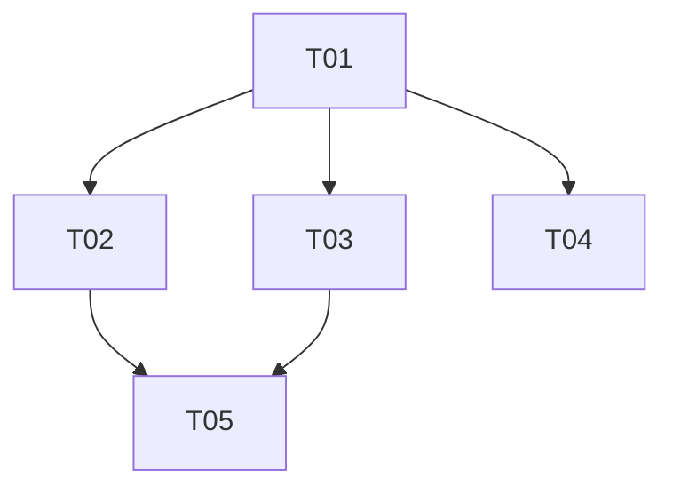

# ECHO Mind 架构收口设计（v0.6）——增量设计与任务分解

> 作者：架构师（高远 Gao）｜基线：`main@bf9f778`｜输入：`docs/02a_真实调用链走读_v0.6.md`
> 目标：把"半落地的被动感知范式"收口为真实可用链路，并修复走读发现的 P0/P1/P2 缺口。
> 约束：本阶段只出设计与任务分解，不修改生产代码。

---

## 1. 新架构树（真实调用链）

### 1.1 目标架构总览（After）

```
┌─ Android ─────────────────────────────────────────────────────────────┐
│ OnboardingScreen(consent+perm)                                          │
│   └─► SensingWindowScheduler(WorkManager 周期 5min / 或 Service 协程)    │
│          ├─► SensorCollector / ScreenCollector / AppActivityCollector   │
│          ├─► MicCollector(可选, 权限+micEnabled 门控)                    │
│          └─► SensingEventHub(进程内共享层, 静态单例)                     │
│                ▲ NotificationCollector(系统绑定, 写 hub)                 │
│  每 5 分钟:                                                              │
│   FeatureExtractor.extractFromCollectors(hub 快照)                       │
│     └─ DerivedFeatureInput(+sources_present)                            │
│        └─ LocalRepository.saveDerivedFeature                            │
│           ├─ Room(feature_vectors, SQLCipher v4: 无 sensor_samples)     │
│           ├─ Outbox(derived_feature / skill_completion)                 │
│           └─ SafetyEngine.evaluatePassive → passiveSafety(UI)           │
│   SyncWorker(WorkManager unique)                                        │
│     └─ POST /v1/features/ingest | /v1/skills/{id}/completions           │
│        410(旧类型)→ 删除 outbox 并标记 deprecated                        │
└─────────────────────────────────────────────────────────────────────────┘
┌─ FastAPI ──────────────────────────────────────────────────────────────┐
│ middleware: request-id → contextvar → audit/structured logs             │
│ CORS allow_methods += PUT/PATCH                                         │
│ POST /v1/features/ingest (flag fail-closed + consent 412 + 幂等)        │
│   └─ DerivedFeature(索引 window_start) → Safety → RiskSignal/Escalation │
│ GET /v1/narratives?from=&to= (只读, 按时间范围查询)                      │
│ GET /v1/profile/{id} (只读缓存) / POST /v1/profile/{id}/rebuild (显式)   │
│ GET /v1/skills (仅 signed) / POST /v1/skills/{id}/completions           │
│ POST /v1/data-subject-requests/{id}/complete (分类矩阵删除+摘要)          │
│ Sandbox: 子进程隔离 + 真超时终止 + 并发槽覆盖执行期                       │
│ audit: tenant-scoped 串行化(advisory lock/唯一约束)                      │
└─────────────────────────────────────────────────────────────────────────┘
```

### 1.2 数据流 Before / After（核心链）

| 环节 | Before（现状） | After（目标） |
|---|---|---|
| 采集启动 | 服务从不启动；flag 默认 true fail-open | Onboarding consent 后启动 `SensingWindowScheduler`；flag fail-closed；权限门控（POST_NOTIFICATIONS/BODY_SENSORS/USAGE_STATS/通知使用权） |
| 5 分钟窗口 | `WINDOW_DURATION_MS` 死常量，无调度器 | WorkManager 周期任务（或 Service 内 `while(isActive){ delay(5min); flush() }`），窗口 flush 后清空 collector 缓冲 |
| 数据共享 | 无共享层；Notification 系统实例不可达 | `SensingEventHub` 进程内单例；NotificationCollector 写 hub；FeatureExtractor 读 hub 快照 |
| 麦克风 | derivedBuffer 无 consumer，64 条即丢 | flush 时 `snapshotAndClear()` → `DerivedFeatureInput(source="mic_opt")` 入 saveDerivedFeature 链 |
| 特征上传 | saveDerivedFeature 生产 0 调用 | 每窗口调用；outbox `derived_feature` → SyncWorker → `/v1/features/ingest` |
| 旧 outbox | 打 410 永久卡死 | SyncWorker 识别 410：删除 outbox、写 deprecated 标记、UI 不再计为待同步 |
| profile/narrative | GET 读副作用、全量拉取 | GET 只读缓存；POST /rebuild 显式重建；时间范围查询 + window_start 索引 |
| Skill 执行 | onTrigger 空 lambda | SkillCardHost 上报 `skill_completion` outbox → `POST /v1/skills/{id}/completions` |
| 版本 | 0.2.0 + alembic v02-v05 错位 | 统一 0.6.0（对外）+ alembic 代号同步 |

---

## 2. 待修点实现方案（文件级）

### 2.1 端侧采集链路接线（P0）——对应走读 A1/A2/A3/A4

**技术选型**：WorkManager `PeriodicWorkRequest`（15 分钟最小周期）不满足 5 分钟窗口 → 采用 **PassiveSensingService 前台服务内协程调度器**（前台服务保活 + `while(isActive){ delay(WINDOW_DURATION_MS); flushWindow() }`），并保留 WorkManager `SyncWorker.enqueue` 作为上行通道。前台服务由 Onboarding 完成 + consent=true 后启动；`ACTION_STOP`/flag=false/consent 撤销时停止。

**文件级改动**：
- 新增 `android/app/src/main/java/com/yunjue/echo/mind/sensing/SensingEventHub.kt`：进程内静态单例，`ConcurrentLinkedDeque<NotificationMeta>` + `clearBefore(ts)`/`snapshotAndClear()`，供 NotificationCollector 写、FeatureExtractor 读。
- 新增 `android/app/src/main/java/com/yunjue/echo/mind/sensing/SensingWindowScheduler.kt`：`start(scope)`/`stop()`，持有 collectors + FeatureExtractor + repository 引用，每 5 分钟：
  1. `hub.snapshotAndClear()` + 各 collector `snapshot()`
  2. `FeatureExtractor.extractFromCollectors(...)`（若 hub 有通知则作为通知输入）
  3. `MicCollector.snapshotAndClear()` → 逐条转 `DerivedFeatureInput(source="mic_opt")`
  4. `repository.saveDerivedFeature(input)`（非空窗口）
  5. 清空 Sensor/Screen/AppActivity 缓冲（防重复）
- 修改 `sensing/PassiveSensingService.kt`：onCreate 建 scheduler；startSensing 启动 scheduler（而非裸 collectors）；stopSensing 停止；`isPassiveSensingEnabled` 默认 false（fail-closed）；增加 `POST_NOTIFICATIONS` 检查。
- 修改 `sensing/NotificationCollector.kt`：`onNotificationPosted` 写 `SensingEventHub`（保留 buffer 或移除）。
- 修改 `sensing/MicCollector.kt`：新增 `snapshotAndClear()`（消费后清空 derivedBuffer）。
- 修改 `sensing/FeatureExtractor.kt`：`extract` 增加 `sources_present: Set<String>` 输出（vector 内各信号是否存在），`selectSource` 保留但补充 `sources_present` 字段（后端 gap_finder 用）。
- 修改 `data/LocalRepository.kt`：`saveDerivedFeature` payload 增加 `sources_present`（可选字段）；`fetchFeatureFlags` 网络失败/无缓存返回 **fail-closed 默认（passive_sensing_enabled=false）**。
- 修改 `data/SyncWorker.kt`：410 分支 → 删除 outbox + 写 `deprecated_events` 本地标记（不重试）；新增 `skill_completion → /v1/skills/{id}/completions` 映射（或 `skill_completion → /v1/skills/completions`）。
- 修改 `data/EchoDatabase.kt`：`version = 4`，Entity 列表移除 `SensorSampleEntity`，DAO 移除 `insertSensorSample/deleteSensorSamplesBefore`；`feature_vectors` 保持。
- 修改 `AppContainer.kt`：新增 `MIGRATION_3_4`（DROP TABLE sensor_samples）；`newSensingEventHub`/`newSensingWindowScheduler` 工厂。
- 修改 `ui/OnboardingScreen.kt`：consent=true 时 `PassiveSensingService.start(context)`；consent=false 时不启动。
- 修改 `ui/SupportScreen.kt`：显示被动采集运行状态/开关联动（停止时写 consent 撤销证据 + SyncWorker）。
- 修改 `AppPreferences.kt`：`defaultFlags()` 中 `passive_sensing_enabled=false`、`sandbox_enabled=false`（隐私敏感 fail-closed）；`skills_delivery_enabled=true` 保留。
- 修改 `AndroidManifest.xml`：`uses-permission POST_NOTIFICATIONS` 运行时已需申请（无 manifest 改动必须项；如加 `RECEIVE_BOOT_COMPLETED` 可后续）。

### 2.2 后端契约收口（P0/P1）——对应 B1/B2/B4b/B4d/B3d/B4e

- 修改 `backend/app/services/profile.py`：
  - `get_profile`（只读，读 UserProfile 缓存，不重建不递增 version）
  - `rebuild_profile`（显式重建：traits + version+1 + updated_at；仅由 POST /rebuild 调用）
  - `build_daily_narrative`：改为 `window_start >= date00:00 AND < date+1` 时间范围查询
  - `update_profile` 重命名/拆分为上述两个函数，全量拉取改为 `window_start >= now-7d` 范围查询
- 修改 `backend/app/services/feature_flags.py`：`DEFAULT_FEATURE_FLAGS` 中 `passive_sensing_enabled=False`、`sandbox_enabled=False`；`is_flag_enabled` 未知 key 返回 False（fail-closed）。
- 修改 `backend/app/api/routes.py`：
  - `get_profile` L1139-1146 → 只读 + audit `profile.read`；新增 `POST /profile/{user_id}/rebuild`
  - `get_daily_narrative` L1149-1170 → 支持 `from=&to=` 批量（响应 `{"date":..., "events":..., "mood_hint":..., "gaps":...}` 或列表）；移除读时 commit 副作用（GET 不写 DailyNarrative，仅在重建/ingest 时写）
  - `ingest_derived_feature` L1088-1136 → payload 支持可选 `sources_present: list[str]`
  - `list_skills` L1298-1348 → `DELIVERABLE_SKILL_STATUSES = ("signed",)`（signed-only）
  - `complete_dsr` L1023-1053 → 分类矩阵删除（见 §4 数据分类矩阵）+ `result_summary` 含删除计数
  - 新增 `POST /skills/{skill_id}/completions`（skill 执行完成/反馈上报；校验 user 归属 + skill signed 状态 + 幂等）
- 修改 `backend/app/main.py`：`allow_methods=["GET","POST","PUT","PATCH","DELETE","OPTIONS"]`；middleware 把 request_id 写入 `contextvars.ContextVar` 供 audit/日志使用。
- 修改 `backend/app/services/audit.py`：`append_audit` 自动从 contextvar 取 request_id（无显式参数时）；新增 per-tenant 写锁（`threading.Lock` dict 或 PostgreSQL advisory lock；SQLite 用模块级锁）串行化 append。
- 修改 `backend/app/schemas.py`：`DerivedFeatureIn` 增加 `sources_present: list[str] | None = None`；新增 `NarrativeRangeOut`/`SkillCompletionCreate`。
- 修改 `backend/app/models.py`：`DerivedFeature` 增加复合索引 `(tenant_id, user_id, window_start)`（迁移中建）；如需 `DailyNarrative.last_rebuilt_at`（可选）。

### 2.3 沙箱隔离 + 审计串行 + 租户画像保护（P0）——对应 B3a/B3b/B4a/B4c

- 修改 `backend/app/services/sandbox/runner.py`：`execute` 改为**子进程隔离执行**（`subprocess.run([sys.executable, "-m", "app.services.sandbox.worker", run_id], timeout=...)`）或至少使用独立 `ProcessPoolExecutor` + `future.result(timeout)` + 超时后 `executor.shutdown(wait=False, cancel_futures=True)` 并 kill；worker 内用**独立 DB Session**（不共享请求线程 Session）；增加 CPU/内存配额（`resource.setrlimit` 或容器化，pilot 用 rlimit 起步）。
- 修改 `backend/app/services/sandbox/scheduler.py`：并发信号量**持有整个执行期**（acquire 在 schedule 时，release 在 runner 结束后），使 `sandbox_max_concurrent` 真实生效。
- 修改 `backend/app/services/audit.py`：tenant-scoped 串行化（§2.2 合并实现）。
- 修改 `backend/app/services/tenant_portrait.py`：`_suppress_small_buckets` 增加"other 桶 <5 时输出 `{"other": null}` 或标记 `suppressed: true`"（不再原样暴露小计数）。
- 新增 `backend/app/services/sandbox/worker.py`：子进程入口（加载 run_id → 独立 Session → `_run_loop` 等价逻辑）。
- 新增测试：`backend/tests/test_sandbox_isolation.py`、`backend/tests/test_audit_concurrency.py`、`backend/tests/test_tenant_portrait_suppression.py`、`backend/tests/test_dsr_matrix.py`。

### 2.4 UI/趋势/Skill 执行反馈（P1）——对应 B5

- 修改 `android/.../ui/OtherScreens.kt`：
  - `TrendScreen`：三态（加载中/失败/空）；失败显示"趋势加载失败"+重试，**不**伪装 observation_days=0；`mood_hint` 折线改为**定性卡片列表**（或明确标注"定性提示，非评分"），移除数值 0-4 折线；`buildTrendValues`/`moodHintToValue` 删除或改语义。
  - `PracticeScreen`：标注"练习由能力卡片驱动"已有，仅文案微调。
- 修改 `android/.../ui/EchoMindApp.kt`：如需隐藏 PRACTICE Tab 或保留（决策点）。
- 修改 `android/.../ui/TodayScreen.kt` / `ui/SkillListScreen.kt`：`SkillCardHost(skill) { repository.recordSkillCompletion(...) }` 接线；同步状态细分（待同步/失败重试/已废弃事件）。
- 修改 `android/.../ui/SkillCardHost.kt`：`onTrigger` 回调保持原生 Button 触发（不变），由调用方上报。
- 修改 `android/.../model/Models.kt`：新增 `SkillCompletionInput(eventId, skillId, status, durationSeconds, clientTime)`。
- 修改 `android/.../data/LocalRepository.kt`：新增 `recordSkillCompletion(input)` → outbox `skill_completion`。
- 修改 `android/.../data/SyncWorker.kt`：映射 `skill_completion → /v1/skills/completions`。
- 修改 `backend/app/api/routes.py` + `schemas.py`：新增 `POST /v1/skills/completions`（幂等、校验 skill 归属与 signed 状态）。
- 集成测试：`E2EFlowTest` 增补 skill completion 上报链路。

### 2.5 版本统一（P0/P2）——对应 §3

- `android/app/build.gradle.kts`：versionName "0.6.0"、versionCode 3
- `backend/app/main.py`：FastAPI/health/console version "0.6.0"
- `README.md`：更新为 v0.6.0 工程包 + 分支 `main`
- `DELIVERY_MANIFEST.json`、`scripts/update_release_metadata.py`、`docs/openapi.json`（重新生成）
- 新增 `RELEASE_NOTES_v0.6.0.md`；`RELEASE_NOTES_v0.2.0.md` 归档不动
- alembic 新 revision 注释用 v0.6 代号（与 release 对齐）

---

## 3. 数据库迁移方案

### 3.1 Android Room：version 3 → 4

| 项 | 内容 |
|---|---|
| 迁移编号 | `MIGRATION_3_4`（`AppContainer.kt`） |
| 操作 | `DROP TABLE IF EXISTS sensor_samples`（移除违反"原始数据不落盘"承诺的死表）；`feature_vectors`/`consents`/`outbox_events` 等保持 |
| Entity 变更 | `EchoDatabase.kt`：`version = 4`；entities 列表移除 `SensorSampleEntity`；DAO 移除 `insertSensorSample`/`deleteSensorSamplesBefore`；可保留 `SensorSampleEntity` 类定义仅作历史（不注册） |
| 向后兼容 | 老库（v3）通过 `addMigrations(MIGRATION_3_4)` 升级；全新安装直接 v4 schema；`DatabaseMigrationTest` 更新 v3→v4 断言（sensor_samples 不存在） |
| 风险 | DROP 不可逆；执行前确认无生产写入（当前 0 写入，低风险） |

### 3.2 Backend Alembic：新 revision `20260731_0003`

| 项 | 内容 |
|---|---|
| 文件 | 新增 `backend/alembic/versions/20260731_0003_v06_contract_hardening.py`（`down_revision="20260731_0002"`） |
| 操作 1 | `op.create_index("ix_derived_features_tenant_user_window_start", "derived_features", ["tenant_id","user_id","window_start"])` |
| 操作 2（可选） | `op.add_column("daily_narratives", sa.Column("last_rebuilt_at", sa.DateTime(timezone=True), nullable=True))` |
| 操作 3（可选） | `op.add_column("user_profiles", sa.Column("rebuilt_at", sa.DateTime(timezone=True), nullable=True))` |
| 向后兼容 | 仅加索引/可空列，不删不改旧数据；旧版本 backend 可继续运行（新代码依赖索引性能，旧代码忽略新列） |
| 回滚 | `downgrade` 删除索引与新增列 |

---

## 4. 新增/修改 API 列表（OpenAPI 契约要点）

| 方法/路径 | 变更 | 契约要点 |
|---|---|---|
| `GET /v1/narratives` | **修改** | 新增 `from`/`to`（YYYY-MM-DD）批量查询；`date` 单日仍兼容；响应保持单日结构（`{id,user_id,date,events,mood_hint,gaps}`）；GET 不再写库（移除读副作用） |
| `POST /v1/profile/{user_id}/rebuild` | **新增** | 显式重建画像；响应 `{user_id, traits, version, updated_at}`；需 role=user 本人 |
| `GET /v1/profile/{user_id}` | **修改** | 只读缓存，不再 version+1/commit；audit action 改 `profile.read` |
| `POST /v1/features/ingest` | **修改** | payload 可选新增 `sources_present: ["accel","screen",...]`；其余契约不变（`extra="forbid"` 保留） |
| `GET /v1/skills` | **修改** | 仅下发 `status=="signed"`；`reviewed` 不再下发；响应结构不变 |
| `POST /v1/skills/completions` | **新增** | body `{event_id, user_id, skill_id, status: started\|completed\|stopped, duration_seconds, client_time}`；幂等（tenant+event_id）；校验 skill 属于 user 且 signed；audit `skill.completion` |
| `POST /v1/data-subject-requests/{request_id}/complete` | **修改** | delete 按数据分类矩阵删除并返回 `result_summary` 含各表删除计数（derived_features/daily_narratives/user_profiles/risk_signals/consents/checkins/journals/questionnaire_results/practice_completions/escalations/emergency_contacts；audit_events 依法保留） |
| `PUT /v1/tenant/flags` | **不变** | CORS 修复后浏览器可调用；flag 语义改 fail-closed |
| CORS | **修改** | `allow_methods=["GET","POST","PUT","PATCH","DELETE","OPTIONS"]` |
| 全量 API | **修改** | 所有 `append_audit` 自动携带 request_id（middleware contextvar）；/health、/console 版本 0.6.0 |

---

## 5. 任务列表（有序，文件级，≤5 任务）

### T01 项目基础设施与版本收口（P0，无依赖）
- **文件**：
  - 修改 `android/app/build.gradle.kts`（versionName 0.6.0 / versionCode 3）
  - 修改 `backend/app/main.py`（version/health/console 0.6.0 + CORS allow_methods + request-id contextvar）
  - 修改 `README.md`、`DELIVERY_MANIFEST.json`、`scripts/update_release_metadata.py`、`docs/openapi.json`（重新生成）
  - 新增 `RELEASE_NOTES_v0.6.0.md`
- **说明**：统一版本号与发布元数据；CORS/request-id 基础设施先行，供后续任务依赖。
- **依赖**：无

### T02 Android 端采集链路接线 + Room v4（P0，依赖 T01）
- **文件**：
  - 新增 `android/.../sensing/SensingEventHub.kt`
  - 新增 `android/.../sensing/SensingWindowScheduler.kt`
  - 修改 `android/.../sensing/PassiveSensingService.kt`
  - 修改 `android/.../sensing/NotificationCollector.kt`
  - 修改 `android/.../sensing/MicCollector.kt`
  - 修改 `android/.../sensing/FeatureExtractor.kt`
  - 修改 `android/.../data/LocalRepository.kt`（sources_present、fail-closed flags、recordSkillCompletion）
  - 修改 `android/.../data/SyncWorker.kt`（410 处理 + skill_completion 映射）
  - 修改 `android/.../data/EchoDatabase.kt`、`android/.../AppContainer.kt`（Room v4 / MIGRATION_3_4）
  - 修改 `android/.../AppPreferences.kt`（fail-closed 默认）
  - 修改 `android/.../ui/OnboardingScreen.kt`、`android/.../ui/SupportScreen.kt`
  - 测试：新增 `SensingWindowSchedulerTest.kt`、`SensingEventHubTest.kt`；修改 `DatabaseMigrationTest.kt`、`PassiveSensingTest.kt`、`E2EFlowTest.kt`
- **说明**：把 5 分钟窗口调度、共享层、麦克风消费、上传链路真实接上；清理 sensor_samples。
- **依赖**：T01

### T03 Backend 契约收口（P0/P1，依赖 T01）
- **文件**：
  - 修改 `backend/app/services/profile.py`（get/rebuild 拆分 + 时间范围查询）
  - 修改 `backend/app/api/routes.py`（profile/narratives/ingest/skills signed-only/DSR 矩阵/skill completions）
  - 修改 `backend/app/schemas.py`
  - 修改 `backend/app/services/feature_flags.py`（fail-closed）
  - 新增 `backend/alembic/versions/20260731_0003_v06_contract_hardening.py`
  - 测试：修改/新增 `backend/tests/test_passive_sensing.py`、`test_skill_delivery.py`、`test_deprecated_routes.py`、`test_dsr_matrix.py`
- **说明**：消除 GET 读副作用、全量拉取、flag fail-open、skill 非 signed-only、DSR 删除矩阵不完整。
- **依赖**：T01

### T04 沙箱隔离 + 审计串行 + 租户画像保护（P0，依赖 T01）
- **文件**：
  - 修改 `backend/app/services/sandbox/runner.py`
  - 新增 `backend/app/services/sandbox/worker.py`
  - 修改 `backend/app/services/sandbox/scheduler.py`
  - 修改 `backend/app/services/audit.py`（tenant-scoped 串行化 + request-id 自动注入）
  - 修改 `backend/app/services/tenant_portrait.py`（other 桶保护）
  - 测试：新增 `backend/tests/test_sandbox_isolation.py`、`test_audit_concurrency.py`、`test_tenant_portrait_suppression.py`
- **说明**：真超时终止 + 执行期并发配额 + 审计链防分叉 + 画像小桶防护。
- **依赖**：T01

### T05 UI 趋势/同步/Skill 执行反馈 + 集成调试（P1，依赖 T02、T03）
- **文件**：
  - 修改 `android/.../ui/OtherScreens.kt`（趋势三态 + 定性展示）
  - 修改 `android/.../ui/TodayScreen.kt`、`android/.../ui/SkillListScreen.kt`、`android/.../ui/SkillCardHost.kt`（skill 执行反馈接线）
  - 修改 `android/.../ui/EchoMindApp.kt`（Tab 语义）
  - 修改 `android/.../model/Models.kt`（SkillCompletionInput）
  - 修改 `android/.../data/LocalRepository.kt`、`android/.../data/SyncWorker.kt`（skill_completion 上报）
  - 后端：`POST /v1/skills/completions`（随 T03 已含，此处联调）
  - 测试：修改 `E2EFlowTest.kt`、`TrendDataSourceTest.kt`、`SkillCardHostTest.kt`
- **说明**：端到端联调（Onboarding→采集→上传→画像→叙事→Skill→执行反馈）；趋势页不再伪装数据。
- **依赖**：T02、T03

**依赖图**：


**优先级归属**：P0 = T01/T02/T03/T04（链路断裂、读副作用、fail-open、沙箱/审计/DSR 安全）；P1 = T05（UI 真实性与执行反馈闭环）。

---

## 6. 依赖包列表

### Android（新增）
- `androidx.work:work-runtime-ktx`（已含，保留；若引入 WorkManager 周期任务可复用）
- 无新增第三方包；调度使用协程 + 前台服务（已有 kotlinx-coroutines）

### Backend（新增）
- `subprocess` 子进程隔离：标准库，无新依赖（若改用容器化则 `docker` 运行时，pilot 暂缓）
- `resource`（rlimit 配额）：标准库
- 审计串行化：标准库 `threading` / PostgreSQL `pg_advisory_xact_lock`（SQLAlchemy `text()`），无新依赖

### 版本锁定
- 保持现有 `requirements.txt`（backend）与 Gradle 依赖锁定；不引入新重型框架。

---

## 7. 共享知识（跨文件约定）

1. **Consent 门控顺序（端侧）**：Onboarding 完成 → `saveConsent(passive_sensing)` → `setPassiveSensingEnabled(true)` → `PassiveSensingService.start()`；任何一步失败不启动。停止路径：用户关闭/权限撤回 → `saveVoiceFeaturesConsent(false)`（mic）或 `saveConsent(passive_sensing,false)` → `PassiveSensingService.stop()` → `SyncWorker.enqueue()`。
2. **Fail-closed 语义**：隐私敏感 flag（`passive_sensing_enabled`/`sandbox_enabled`）在无缓存、网络失败、未知 key 时一律为 **false**（不采集、不跑沙箱）；`skills_delivery_enabled` 非隐私敏感可默认 true。
3. **事件类型常量表（Android outbox eventType）**：
   - `derived_feature` → `POST /v1/features/ingest`
   - `skill_completion` → `POST /v1/skills/completions`
   - `consent` / `l0` / `emergency_contact` / `escalation` / `dsr` → 不变
   - `checkin` / `journal` / `questionnaire:*` / `practice` → **deprecated**：410 时删除 outbox 并本地标记，不重试
4. **DerivedFeature 契约**：`schema_version="feat-v1"`、`summary≤4000`、`vector≤256`、`sources_present: list[str]`（新增可选字段，枚举：accel/gyro/screen/notification/app_activity/mic_opt/health）。
5. **审计**：所有写操作 `append_audit` 自动带 request_id（contextvar）；audit 表只增不改；并发写入经 tenant-scoped 串行化。
6. **读无副作用**：GET 端点禁止写库/version 递增；重建走显式 POST。
7. **时间语义**：全链使用 ISO 8601 UTC；Android `Instant` ↔ backend `datetime(timezone.utc)`；Room 存 epoch ms。
8. **SQLCipher**：全库加密口令由 Keystore 派生（`FieldCipher.deriveDatabasePassphrase`），不硬编码。
9. **Skill 状态机**：`draft→reviewed→signed→retired`，不可跳级/逆转；**仅 signed 下发**；retire 通过 batch-retire/transition 生效，客户端以拉取过滤 + 1h 缓存 TTL 收敛。

---

## 8. 待明确事项

1. **5 分钟窗口的调度载体**：前台服务协程（推荐，保活强）vs WorkManager 周期任务（15 分钟下限不满足 5 分钟，需 `setExpedited` 变通）——需产品/运维确认电量策略。
2. **Skill 执行反馈的语义**：`completions` 仅记录"已开始/完成/停止"是否足够？是否需要服务端把执行结果回写为 Skill 使用率（用于 sandbox 后续归纳）？
3. **趋势页改版**：mood_hint 折线改为"定性卡片列表"还是"保留折线但显著标注非评分"？需产品确认（涉及 `TrendDataSourceTest`/`SkillCardHostTest` 断言语义）。
4. **PRACTICE Tab 去留**：隐藏还是保留停用骨架？影响 `EchoMindApp.kt` Tab 枚举与测试。
5. **DSR 删除矩阵范围**：是否包含 `escalations`/`emergency_contacts`（危机处置记录可能需法定留存）？建议默认删除被动感知产物 + 用户主动内容，保留审计与危机处置记录，需法务确认。
6. **沙箱子进程隔离深度**：pilot 用 rlimit 子进程（低改造成本）vs 容器化（高成本）？影响 `runner.py` 实现与 `test_sandbox_isolation.py` 断言。
7. **版本号目标**：统一到 0.6.0（本设计假设）还是 0.2.1 patch？需产品/发布确认后落地 T01。

---

## 9. 交付物
- `docs/02a_真实调用链走读_v0.6.md`（本设计输入，走读证据）
- `docs/02b_架构收口设计_v0.6.md`（本文档）
- `docs/sequence-diagram.mermaid`（见附件：核心链时序图）
- `docs/class-diagram.mermaid`（见附件：类图）
