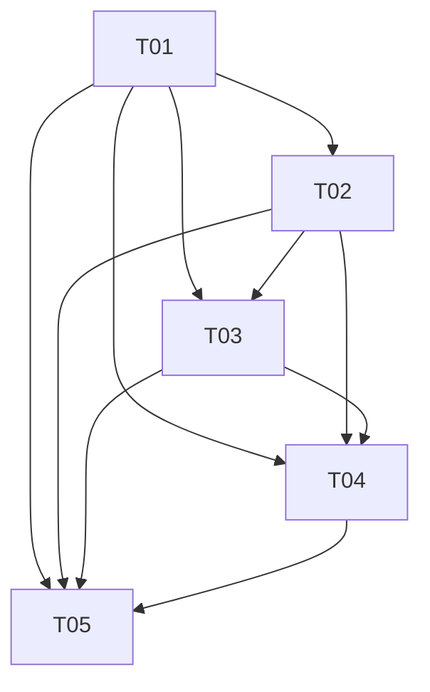

# ECHO Mind 收口任务分解（v0.6 final）

> 作者：架构师 高见远（Gao）｜输入：`docs/02c_收口架构设计_v0.6final.md`
> 用途：工程师直接按此实施。实现顺序 = 任务编号顺序（先 backend 契约层 → 再 android → 再 CI/测试/交付物）。
> 约束：最小改动；不破坏 02c §1.2 列出的全部边界不变量。每项含 文件路径 / 修改内容 / 依赖 / 验收标准。

**依赖图**

---

## T01 Backend 契约层收口（P0/P1）

**职责**：修复沙箱缺口识别与情绪边界；趋势接口退休；Onboarding verify-code 后端；legacy 死代码（backend 侧）清理；OpenAPI/文档同步。

**文件与修改内容**：

1. `backend/app/services/sandbox/gap_finder.py`
   - 新增 `_row_sources(row) -> set[str]`：`row.sources_present` 非空时返回其并集，否则 fallback `{row.source}`。
   - `find_gaps` 第 2 步改为 `present = set().union(*[_row_sources(f) for f in day_features])`（空列表 → 空集）。
   - 保持 `EXPECTED_SOURCES = (accel, gyro, screen, notification, app_activity)` 不变（mic_opt 可选、health 不强制）；gap_id 不变。
   - 模块 docstring 补充契约说明。
2. `backend/app/services/sandbox/audit_day.py`
   - summary 增加 `"sources_present": sorted(union)`（沿用 `_row_sources` 同口径；可由 gap_finder 导出 helper 或本地重复实现，避免跨模块耦合过深）。
3. `backend/app/services/sandbox/tool_forge.py`
   - 删除 `_TEMPLATES["mood_check"]`（83-113 行）。
4. `backend/app/services/sandbox/skill_induct.py`
   - `_TOOL_TYPE_TO_ACTION_TYPE` 删除 `"mood_check": "reflection_prompt"`（37 行）。
5. `backend/app/services/profile.py`
   - `build_daily_narrative` events 增加 `"sources_present": list(f.sources_present or [])`（73-76 行）。
   - `rebuild_profile` traits 增加 `"sources_present_union": sorted(union)`（P2，可选；观察窗口 `window_start >= now-7d` 内并集）。
   - DailyNarrative.gaps 写路径保持 `[]`，加 `# legacy 预留` 注释。
6. `backend/app/api/routes.py`
   - 删除 `GET /v1/trends/summary` 路由（512-516 行）及 `days` Query 参数；保留 `from app.services.trends import build_trend`（case-review 798 行使用）。
   - 新增 `POST /v1/onboarding/verify-code`（schemas 见 7）：跨租户查 `User.external_ref == code`；0 命中 → 404；restricted → 403；active → `create_access_token(role="user")`；响应含 `user_id/access_token/consent_versions/l0_decision/restricted`；写 audit `onboarding.verify`；无内部字段泄露。
7. `backend/app/schemas.py`
   - 新增 `OnboardingVerifyIn {code: str(8..80)}`、`OnboardingVerifyOut`（上述字段）。
   - `TenantPortraitOut.mood_distribution` 加 `@legacy` 注释（保留字段恒空 + suppressed）。
8. `backend/alembic/versions/20260810_0002_v06_final.py`（新增，P2 可选）
   - `op.create_index("ix_users_external_ref", "users", ["external_ref"])`（支撑 verify-code 扫描）；down_revision=`20260810_0001`。
9. `backend/tests/test_sandbox_loop.py`
   - 新增：`test_gap_finder_uses_sources_present_union`（多窗口同 source 不同 sources_present → 并集后不误报缺失）、`test_gap_finder_fallback_to_source_when_sources_present_empty`、`test_gap_finder_mic_opt_missing_no_gap`、`test_gap_finder_health_not_mandatory`、`test_gap_finder_legacy_single_source_behavior`。
   - 既有 `test_gap_finder_missing_source` 保持通过（构造特征带 sources_present 或不带皆可）。
10. `backend/tests/test_deprecated_routes.py`
    - `test_get_trends_summary_still_available` 改为 `test_trends_summary_removed_returns_404`。
11. `backend/tests/test_onboarding_verify_code.py`（新增）
    - 有效码 200（含 user_id/token/consent_versions）；无效码 404；restricted 用户 403；响应无 tenant_id/role/external_ref；无 token 401；重复调用幂等。
12. `backend/scripts/export_openapi.py` 运行 → `docs/openapi.json` 重新生成（trends 路径消失、verify-code 出现）。
13. `docs/03_API契约.md`：删除 `/v1/trends/summary` 行；新增 `/v1/onboarding/verify-code` 行。
14. 清理 backend 侧 legacy 死代码（G 分类 C）：确认无 writer/reader 残留于 `recent_mood_hint`/`mood_hint` 写入路径（profile/audit_day 已恒 None，仅注释确认）。

**依赖**：无（独立于 Android）。
**验收标准**：
- `cd backend && ruff check app tests && pytest -q` 全绿（含新增用例）。
- OpenAPI 重新生成后无 `trends/summary` 路径，有 `onboarding/verify-code`。
- `find_gaps` 在「两个 accel 窗口分别声明 screen/notification 不同 sources_present」时不再误报 screen/notification 缺失。
- `mood_check` 模板与映射彻底消失（grep `mood_check` 0 命中于 tool_forge/skill_induct）。
- verify-code 响应不含内部字段（单测断言）。

---

## T02 Android 契约与感知链路收口（P0/P1）

**职责**：窗口 ACK 语义重构（消除静默丢失）；ActiveSkillSession 持久化；action_type 白名单分发器；Onboarding 契约化（移除内部字段）；Skill 契约字段消费。

**文件与修改内容**：

1. `sensing/SensingEventHub.kt`
   - 新增 `data class HubSnapshot(...)`；`fun snapshotAll(): HubSnapshot`（非破坏）；`fun clearConsumed(snapshot: HubSnapshot)`（按项 removeAll，FloatArray 引用相等）；flush 路径不再使用 `clearAll()`（保留给 stop/revoke）。
2. `sensing/MicCollector.kt` + `sensing/MicFeatureExtractor.kt`
   - `MicDerivedFeatureSource` 拆 `snapshot()` + `clearConsumed(list)`；scheduler 不再调用破坏性 `snapshotAndClear`（方法删除或标注 deprecated）。
3. `sensing/SensingWindowScheduler.kt`
   - `flushWindow` 返回 `WindowFlushResult { SUCCESS, FAILURE_RETRYABLE }`；`onWindowReady` 签名改 `suspend (List<DerivedFeatureInput>) -> Boolean`；`flushedWindowStarts.add` 移到成功之后；失败进 `pendingRetries[startMs]`（`MAX_WINDOW_RETRY=3`）；成功路径 clear consumed（hub + mic）。
4. `sensing/PassiveSensingService.kt`
   - `startSensing` 回调：`repository.saveDerivedFeatures(inputs)` → Boolean → 成功才 `SyncWorker.enqueue` + true；失败 false。
   - `stopSensing`：`scheduler?.stop()` + 清 pendingRetries + `hub.clearAll()`；consent revoke 不补发。
5. `data/LocalRepository.kt`
   - 新增 `suspend fun saveDerivedFeatures(inputs): Boolean`（`db.withTransaction` 批量 insert + enqueue；异常 → false）；成功才更新 `lastSuccessfulCollection`。
   - ActiveSkillSession：`loadActiveSession/saveActiveSession/deleteActiveSession`；`saveSkillCompletion` 改为「删除会话 + 插入 outbox」同一事务。
   - `verifyOnboardingCode(code)`：调 `POST /v1/onboarding/verify-code`，存 `userId` + 加密 `accessToken`，返回结果。
   - `parseSkillsArray` 解析 `actionType/estimated_duration/completion_schema/safety_constraints/revision`。
   - 移除 mood 解析：`ProfileDisplay.recentMoodHint`、`NarrativeDisplay.moodHint`/`NarrativeEventDisplay.moodHint` 相关读取。
6. `data/EchoDatabase.kt`
   - Room v5；新增 `active_skill_sessions` Entity + DAO（upsert/get/delete）；DAO 增加批量 `insertFeatureVectors`/`insertOutboxEvents`（或 withTransaction 循环）。
7. `AppContainer.kt`
   - `MIGRATION_4_5`：`CREATE TABLE active_skill_sessions (...)`；注册到 `addMigrations`。
8. `AppPreferences.kt`
   - 新增 `lastPersistenceFailure: Long?`、`consecutivePersistenceFailures: Int`（成功后清零）、`onboardingState: String`；暴露 Flow。
9. `model/Models.kt`
   - `SkillDisplay` 扩展字段 + `ACTION_TYPE_WHITELIST`；`ActiveSkillSession` 数据模型；删除 `CheckinInput/saveCheckin` 相关死代码引用（T02 范围内仅清理模型字段与引用）。
10. `ui/SkillCardHost.kt`
    - `SkillRunSession` 持久化改造：pause 累计 `accumulatedActiveMs`（暂停不计时）、`segmentStartedAtMs` 语义、`activeDurationMs(now)`；启动时 `loadActiveSession()` 恢复为 PAUSED；terminal 操作 `saveSkillCompletion`（事务内删会话）。
    - action_type 分发：`skill.actionType` 不在白名单 → 不渲染「开始」；`ActionRenderer` 分发到 renderer。
11. `ui/SkillActionRenderers.kt`（新增）
    - `GuidedStepsContent / BreathingContent / ChecklistContent / JournalingContent / ReflectionContent / BlockedContent`；`ActionRenderer` when 分发 + else fail closed。
12. `ui/OnboardingScreen.kt`
    - 删除「机构邀请码 / 试点用户 ID / 机构配置令牌」输入框 → 单「激活码」字段；`verifyOnboardingCode` 成功后推进状态机（`onboardingState`），继续 consents→L0→（可选）紧急联系人→completed；restricted 分支展示人工支持。
13. `ui/OtherScreens.kt`
    - SupportScreen 展示「最近成功采集 / 最近持久化失败 / 连续失败」；移除 mood 渲染（TrendContent 无 mood_hint 依赖，确认无）。
14. 测试更新/新增：
    - 改：`SensingWindowSchedulerTest`（flush 时序/去重语义）、`PassiveSensingTest`（回调返回语义）、`SkillCardHostTest`（持久化+恢复）、`OnboardingGateTest`（七态）、`DatabaseMigrationTest`（v4→v5）、`TrendDataSourceTest`（移除 mood 字段）、`SyncWorkerStateMachineTest`（410/429 语义不变）。
    - 新增：`WindowAckTest`（persist 失败不丢、bounded retry、revoke 不补发）、`ActiveSkillSessionTest`（暂停不计时/恢复为 PAUSED/事务删会话）、`SkillActionDispatcherTest`（5 renderer + unknown fail closed + 无 completion）、`OnboardingVerifyFlowTest`（verify-code 成功/失败/restricted 状态机推进）。

**依赖**：T01（verify-code 后端、openapi 契约）。
**验收标准**：
- `./gradlew testDebugUnitTest lintDebug` 全绿。
- 单测注入 `saveDerivedFeatures=false` 时窗口不进 flushed 集、缓冲未清、重试 ≤3、`consecutivePersistenceFailures` 递增；成功路径缓冲仅清 consumed 项（新到事件保留）。
- ActiveSkillSession：暂停后 `activeDurationMs` 不再增长；进程重建（新 repository 实例）后恢复为 PAUSED；完成时 outbox 有 `skill_completion` 且会话行删除。
- 未知 `actionType` 卡片显示「不可用」且不产生 completion。
- Onboarding 界面不再出现 `userId/accessToken/institutionCode` 输入框（单测断言）。

---

## T03 CI 深化 + 契约漂移 + 故障注入验证（P1）

**职责**：workflow 深化（mypy/PG/coverage/OpenAPI drift/contract drift；android connected 矩阵；security 全量）；契约 manifest 与校验脚本；故障注入矩阵脚本。

**文件与修改内容**：

1. `.github/workflows/backend-ci.yml`
   - 拆分 job：`lint-typecheck`（ruff + mypy）、`test-postgres`（service container postgres:16 + `pytest --cov=app --cov-fail-under=80`）、`alembic-postgres`（upgrade head + downgrade base on PG）、`static-checks`（content validation + claim scan + dynamic-code + safety eval）、`openapi-drift`（export + `git diff --exit-code docs/openapi.json`）、`contract-drift`（`python scripts/contract_drift_check.py`）。
   - actions（checkout/setup-python/upload-artifact）pin 到 commit SHA。
2. `backend/pyproject.toml`
   - dev 依赖加 `pytest-cov`；新增 `[tool.mypy]` 配置段（`python_version="3.12"`、`check_untyped_defs=true`、`ignore_missing_imports=true` 起步）。
3. `.github/workflows/android-ci.yml`
   - 保留 `unit-lint`（testDebugUnitTest + lintDebug + assembleDebug）。
   - 新增 `connected-test`：matrix api-level [34, 36]，`reactivecircus/android-emulator-runner@<sha>` + `./gradlew connectedDebugAndroidTest`。
   - actions pin SHA。
4. `docs/contract-manifest.json`（新增）
   - 声明路径/字段/枚举/410 语义/移除项（见 02c §H.3）。
5. `scripts/contract_drift_check.py`（新增）
   - 读 `docs/openapi.json` vs `docs/contract-manifest.json`，逐项断言；不匹配 exit 1。
6. `.github/workflows/security-ci.yml`
   - trufflehog / sbom-action / codeql-action(init+analyze, python) / dependency-review-action / pip-audit / osv-scanner / trivy-action fs scan；全部 pin SHA；保留 schedule。
   - （P2 可选）`.github/dependabot.yml`。
7. `scripts/fault_injection_check.py`（新增）
   - 静态断言 SyncWorker 状态机（classifySyncOutcome 全分支）；输出故障注入场景清单与验证入口（供 QA 使用）。
8. 新增 `android/app/src/androidTest/...` instrumentation：
   - `RoomMigrationInstrumentedTest`（v3→v4→v5）、`ProcessRecreationTest`（active session 恢复）、`WorkManagerSyncTest`（enqueue+run+410/429）、`OnboardingFlowInstrumentedTest`。
   - `android/app/build.gradle.kts` 增加 androidTest 依赖（如需 androidx.test）。

**依赖**：T01、T02（CI 校验对象先落地）。
**验收标准**：
- backend-ci 各 job 绿（PG 环境 pytest 全绿；alembic PG upgrade/downgrade 成功；openapi/contract drift 无 diff）。
- android-ci connected-test 在矩阵 API 34/36 通过（Room 迁移/恢复/WorkManager/onboarding 用例）。
- security-ci：CodeQL/pip-audit/osv-scanner/trivy 无新增高危（既有基线记录）；无 @main/@vN 可变 tag（grep 校验 workflow 内 `uses: .*@` 均为 40 位 SHA）。
- `scripts/contract_drift_check.py` 本地运行 0 退出。

---

## T04 全量测试更新与回归配套（P1）

**职责**：把 02c §I 故障注入矩阵固化为可回归测试；补齐 backend/android 测试；供 QA 直接执行。

**文件与修改内容**：

1. `backend/tests/test_sandbox_loop.py` / `test_passive_sensing.py` / `test_deprecated_routes.py` / `test_onboarding_verify_code.py`
   - 回归覆盖：sources_present 并集、mic/health、trends 404、verify-code。
2. `backend/tests/test_sandbox_isolation.py` / `test_sandbox.py`
   - 确认 gap_finder 变更不影响子进程隔离回路断言（gaps_found 仍非空）。
3. `android/app/src/test/.../SyncWorkerStateMachineTest.kt`
   - 扩展：401/403/410 deprecated/410 non-deprecated/412/422/429/500/duplicate 全分支（故障矩阵 1-13）。
4. `android/app/src/test/.../WindowAckTest.kt`（T02 已建，此处补齐断言矩阵 15-16）
5. `android/app/src/test/.../ActiveSkillSessionTest.kt` / `SkillActionDispatcherTest.kt`（T02 已建，补齐边界）
6. `android/app/src/test/.../ConsentLifecycleTest.kt` / `SafetyEnginePassiveTest.kt`
   - 确认被动 RED 链路无回归（ingest 不触发 escalation，恒 NONE）。
7. `backend/tests/test_tenant_portrait.py` / `test_tenant_portrait_suppression.py`
   - 确认 mood_distribution 恒空 + suppressed 断言不变。
8. `backend/tests/test_skill_signed_only.py` / `test_skill_delivery.py`
   - 确认 signed-only + whitelist 下发断言不变。

**依赖**：T01、T02、T03。
**验收标准**：
- `cd backend && pytest -q` 全绿（含全部新增/修改）；`./gradlew testDebugUnitTest connectedDebugAndroidTest` 全绿。
- 故障注入矩阵 1-16 在测试/脚本中有对应断言或明确验证入口。
- 无新增对情绪/危机被动推断的回归（SafetyEnginePassiveTest 等保持红绿语义）。

---

## T05 收口交付物与发布一致性（P1/P2）

**职责**：文档/版本/清单一致性；确认迁移链完整；最终回归入口说明。

**文件与修改内容**：

1. `docs/openapi.json`：最终重新生成并提交（T01 已生成，此处确认与 contract-manifest 一致）。
2. `docs/03_API契约.md`：核对全部变更行（trends 移除、verify-code 新增、skill contract 字段）。
3. `README.md` / `RELEASE_NOTES_v0.6.0.md`：补充「v0.6 final 收口」要点（sources_present 契约、窗口 ACK、ActiveSkillSession、verify-code、CI 深化）。
4. `scripts/update_release_metadata.py` 运行 → `DELIVERY_MANIFEST.json` / `FILE_HASHES.sha256` 重新生成。
5. `backend/alembic`：确认 `alembic upgrade head`（SQLite 与 PG）均可执行；新 migration 注释与 v0.6 代号一致。
6. `content-packs/`：questionnaires/practices 归档到 `releases/legacy-content-packs/`（或加 `.deprecated` 标记）；`scripts/validate_content_packs.py` 更新为跳过 legacy（若影响 MANIFEST 生成需同步）。
7. 最终回归入口：README 或 `RELEASE_NOTES_v0.6.0.md` 标注 QA 回归命令（backend pytest + android test/connected + CI 各 job）。

**依赖**：T01–T04。
**验收标准**：
- `git diff --exit-code docs/openapi.json` 干净（与 export 一致）。
- `DELIVERY_MANIFEST.json` / `FILE_HASHES.sha256` 与仓库实际文件一致。
- alembic upgrade/downgrade 双向通过（SQLite + PG）。
- 无遗留指向已移除 `/v1/trends/summary` 的文档/脚本引用（grep 0 命中于非历史 docs）。
- legacy 归档完成且 validate 脚本可运行。

---

## 任务速览

| Task | 名称 | 依赖 | 优先级 |
|---|---|---|---|
| T01 | Backend 契约层收口 | 无 | P0/P1 |
| T02 | Android 契约与感知链路收口 | T01 | P0/P1 |
| T03 | CI 深化 + 契约漂移 + 故障注入验证 | T01, T02 | P1 |
| T04 | 全量测试更新与回归配套 | T01, T02, T03 | P1 |
| T05 | 收口交付物与发布一致性 | T01–T04 | P1/P2 |
