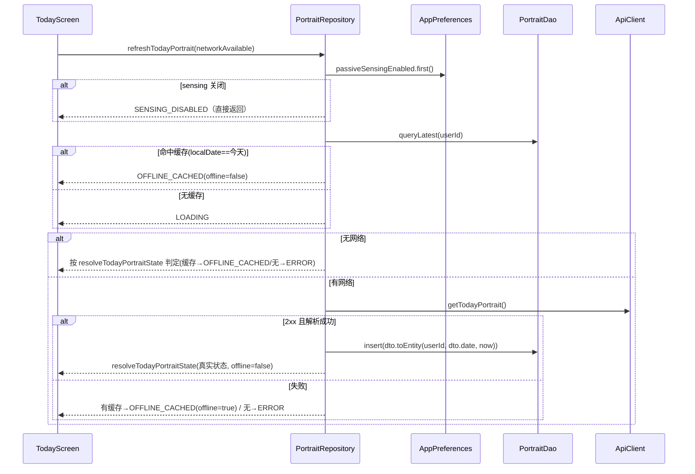
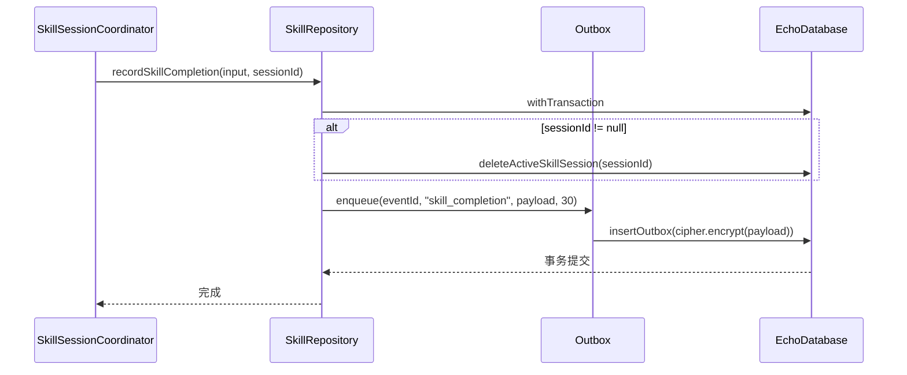
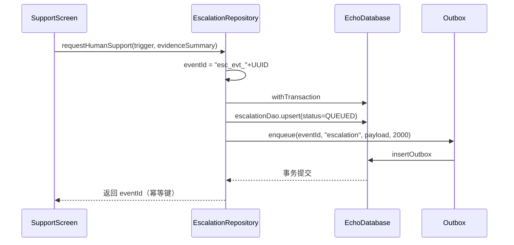

# LocalRepository 拆分设计 v0.7.1

> 目标：把 `android/app/src/main/java/com/yunjue/echo/mind/data/LocalRepository.kt`（约 1308 行，7 个领域混装）按 bounded context 拆分为多个单一职责仓库。
> 现状基线：`main = 63570a0`，工作区干净。后端已在 v0.6.1 完成 bounded-context 路由拆分（`app/api/` 12 个 router），客户端尚未跟上。
> 性质：**纯设计文档**。除本文件外不改动任何代码。

---

## 1. 现状诊断

### 1.1 领域归类总览

| 域 | 方法数 | 特征 | 行号区间（LocalRepository.kt） |
|---|---|---|---|
| Outbox 基础设施 | 2 | 跨域共享写入原语 | 124–134 |
| Consent / L0 / 紧急联系人 / DSR | 6 | JSON 构造 + SHA-256 证据 + enqueue | 136–222, 590–598 |
| Sensing（派生特征） | 4 | 事务落库 + ACK 状态机 + 失败观测 | 92–93, 237–294 |
| Skill 会话 + 完成 | 7 | 5 个纯 DAO 透传 + 1 个事务状态机 + 重载 | 303–363 |
| Escalation（人工支持） | 8 | 事务 upsert + 回写 + 网络 + JSON 解析 | 368–487 |
| Onboarding | 4 | 网络 + preferences 状态机 + 跨域删除 | 46–59, 500–588 |
| Feature Flags | 2 | 网络 + 缓存 + Flow 透传 | 89, 613–635 |
| Skill 列表拉取 | 4 | 阻塞网络 + 缓存 + JSON 解析 | 650–672, 841–900 |
| Narrative / Profile（遗留） | 6 | 阻塞网络 + 缓存 + JSON 解析 | 686–831 |
| Portrait | 15+ | 状态流 + 缓存优先状态机 + 反馈 + mapper + parse | 909–1306 |
| 同步状态观测 | 10 | 几乎全是 preferences 透传 | 97–122 |
| Legacy 主动输入 | 6 | 纯 DAO 透传 + cipher 透传 | 82–86, 600 |

### 1.2 方法清单（按域，含行号与性质）

**A. 基础设施（跨域共享，拆出 `Outbox` 原语）**

| 方法 | 行号 | 性质 |
|---|---|---|
| `basePayload(eventId, clientTime)` | 124–128 | JSON 构造（私有） |
| `enqueue(eventId, type, payload, priority)` | 130–134 | outbox 写入原语（私有，5 个域复用） |

**B. Consent / L0 / 紧急联系人 / DSR（→ `ConsentRepository`）**

| 方法 | 行号 | 性质 |
|---|---|---|
| `saveConsent(...)` | 136–152 | 业务：JSON + enqueue |
| `savePassiveSensingConsent(granted, priority)` | 155–167 | 业务：SHA-256 证据 + 委托 saveConsent |
| `saveVoiceFeaturesConsent(granted)` | 180–193 | 业务：SHA-256 证据 + 委托 saveConsent |
| `saveL0(...)` | 195–211 | 业务：JSON + enqueue |
| `saveEmergencyContact(...)` | 213–222 | 业务：JSON + enqueue |
| `requestDataAction(type)` | 590–598 | 业务：JSON + enqueue |

**C. Sensing / 派生特征（→ `SensingRepository`）**

| 方法 | 行号 | 性质 |
|---|---|---|
| `_passiveSafety` / `passiveSafety` | 92–93 | 状态流（被动安全，恒 NONE） |
| `saveDerivedFeatures(inputs): Boolean` | 237–253 | **业务状态机**：withTransaction + 成功/失败观测写回 preferences |
| `saveDerivedFeature(input): SafetyDecision` | 256–262 | 兼容旧调用方，恒 NONE decision |
| `persistDerivedFeature(input)` | 265–294 | 私有：JSON + cipher + insertFeatureVector + enqueue |

**D. Skill 会话 + 完成（→ `SkillRepository`）**

| 方法 | 行号 | 性质 |
|---|---|---|
| `recordSkillCompletion(input, sessionId)` | 303–326 | **业务状态机**：withTransaction(delete + outbox) |
| `recordSkillCompletion(skillId, status, duration)` | 329–333 | 便捷重载 |
| `saveActiveSession(session)` | 338–340 | **DAO 透传** |
| `loadActiveSession(skillId)` | 349–350 | **DAO 透传** |
| `hasAnyActiveSession()` | 353 | **DAO 透传** |
| `clearActiveSessions()` | 356–358 | **DAO 透传** |
| `deleteActiveSession(sessionId)` | 361–363 | **DAO 透传** |

**E. Escalation（→ `EscalationRepository`）**

| 方法 | 行号 | 性质 |
|---|---|---|
| `observeEscalations()` | 368 | **DAO 透传**（Flow） |
| `latestEscalation()` | 371 | **DAO 透传** |
| `requestHumanSupport(trigger, evidenceSummary): String` | 384–421 | **业务状态机**：withTransaction(upsert + outbox)，幂等键 |
| `markEscalationDelivered(eventId, serverId)` | 428–438 | 业务：回写 delivered |
| `updateEscalationServerStatus(eventId, json)` | 441–451 | 业务：回写 + parseServerStatus |
| `parseServerStatus(json)` | 454–463 | JSON（私有，fail-closed） |
| `markEscalationFailed(eventId)` | 466–471 | 业务：回写 failed |
| `refreshEscalationStatus(escalationId)` | 477–487 | 网络 GET + 回写 |

**F. Onboarding（→ `OnboardingRepository`）**

| 方法 | 行号 | 性质 |
|---|---|---|
| `OnboardingVerifyResult` / `OnboardingVerifyException` | 46–59 | data class / exception |
| `confirmServerActivation(): Boolean` | 500–534 | **业务状态机**：网络核对 + prefs READY 收敛 |
| `verifyOnboardingCode(code): OnboardingVerifyResult` | 545–574 | **业务状态机**：网络 + prefs + **跨域 deleteByUser** |
| `parseVerifyCodeResponse(body)` | 576–588 | JSON（私有） |

**G. Feature Flags（→ `FeatureFlagRepository`）**

| 方法 | 行号 | 性质 |
|---|---|---|
| `featureFlagsFlow` | 89 | preferences 透传（Flow） |
| `fetchFeatureFlags(): Map` | 613–635 | 网络 + 缓存 + fail-closed |

**H. Skill 列表拉取（→ `SkillRepository`）**

| 方法 | 行号 | 性质 |
|---|---|---|
| `fetchSkills(): SkillFetchResult` | 650–672 | 阻塞网络 + 缓存 + 解析 |
| `parseSkillResponse(json)` | 841–848 | JSON（私有） |
| `parseSkillsArray(arr)` | 859–876 | JSON（私有） |
| `toStringList` / `toTriggerStrings` / `toStepDescriptions` | 878–900 | JSONArray 扩展（私有） |
| `SkillFetchResult` | 69–74 | data class |
| `SKILL_CACHE_TTL_MS` | 1239 | 常量 |

**I. Narrative / Profile（→ `NarrativeProfileRepository`）**

| 方法 | 行号 | 性质 |
|---|---|---|
| `fetchNarratives(days): NarrativeFetchResult` | 686–706 | 阻塞网络 + 缓存 + 解析 |
| `fromNarrativeCacheOrFail(...)` | 708–721 | 私有：缓存兜底 |
| `fetchProfile(): ProfileDisplay` | 731–751 | 阻塞网络 + 解析 |
| `defaultProfile(...)` | 753–759 | 私有 |
| `parseNarrative(json)` | 762–779 | JSON（私有） |
| `parseNarrativeRange(json, from, to)` | 784–831 | JSON（私有） |

**J. Portrait（→ `PortraitRepository`）**

| 方法 | 行号 | 性质 |
|---|---|---|
| `_todayPortraitState` / `observeTodayPortrait()` | 909–914 | 状态流暴露 |
| `_timelineState` / `observePortraits(days)` | 916–922 | 状态流暴露 |
| `refreshTodayPortrait(networkAvailable)` | 934–1014 | **核心业务状态机**：缓存优先 + 后台刷新 + 九态 |
| `refreshPortraits(days)` | 1021–1088 | **核心业务状态机**：网络 + Room 窗口缓存兜底 |
| `fetchBaselineStatus()` | 1094–1105 | 网络 + parse |
| `recordPortraitFeedback(date, helpful)` | 1117–1129 | 业务：prefs + outbox |
| `portraitFeedback(date)` | 1132 | preferences 透传 |
| `DailyPortraitEntity.toDto()` | 1144–1175 | mapper（私有） |
| `DailyPortraitDto.toEntity(...)` | 1178–1211 | mapper（私有） |
| `toJsonObject` / `toAnyMap` | 1214–1235 | helper（私有） |
| companion `parseDailyPortrait` / `parsePortraitList` / `parseBaselineStatus` | 1247–1306 | **JSON 纯函数**（internal，供纯 JVM 单测） |

**K. 同步状态观测（→ `SyncStateRepository`）**

| 方法 | 行号 | 性质 |
|---|---|---|
| `passiveSensingConsentFlow()` | 97 | preferences 透传 |
| `lastSyncTimestamp()` | 99 | preferences 透传 |
| `lastCollectionTimestamp()` | 100 | preferences 透传 |
| `lastSyncHttpCode()` | 101 | preferences 透传 |
| `deadLetterCount()` | 102 | preferences 透传 |
| `isAuthBlocked()` | 106 | preferences 透传 |
| `lastSyncErrorClass()` | 109 | preferences 透传 |
| `lastPersistenceFailure()` | 114 | preferences 透传 |
| `consecutivePersistenceFailures()` | 117 | preferences 透传 |
| `pendingUploadCount()` | 120–122 | **DAO 透传**（runBlocking 查询） |

**L. Legacy 主动输入（→ `LegacyInputRepository`，v0.8 删除目标）**

| 方法 | 行号 | 性质 |
|---|---|---|
| `observeCheckins()` | 82 | DAO 透传 |
| `observeJournals()` | 83 | DAO 透传 |
| `observeQuestionnaires()` | 84 | DAO 透传 |
| `observePractices()` | 85 | DAO 透传 |
| `observePendingCount()` | 86 | DAO 透传（归入 SyncStateRepository，见下） |
| `decryptJournal(value)` | 600 | cipher 透传 |

### 1.3 关键诊断结论

1. **约 40% 是纯透传**：D、K、L 三域合计 20 个方法中，17 个是 DAO/preferences/cipher 的零逻辑透传，可直接由调用方改读 `container.preferences` / `container.database`，或收进轻量仓库。真正的业务状态机集中在 C、D(completion)、E、F、J 五处。
2. **`enqueue`/`basePayload` 是跨域共享原语**：B/C/D/E/J 五个域都写 outbox。若不抽离，每个新仓库都会复制 `cipher.encrypt + insertOutbox` 逻辑，是本次拆分最大重复来源。
3. **`verifyOnboardingCode` 存在跨域耦合**：L565 调 `db.portraitDao().deleteByUser(previousUserId)`（账户切换清理画像缓存）。这是唯一跨 bounded context 的 DAO 调用，拆分时必须显式注入，不得在 OnboardingRepository 内直连 PortraitDao。
4. **`ConsentDao` 是死 DAO**：`EchoDatabase.consentDao()` 已定义（insertConsent/latestConsent/consentsByType/grantedCount），但 LocalRepository 全程未调用。consent 证据只写 outbox、不落 `consents` 表。拆分时不引入该依赖，留待 v0.8 决定保留或删除。
5. **Portrait 域超重**：J 域自带状态机 + mapper + parse，是唯一可能超过 300 行的目标仓库，须把 parse 纯函数与 DTO↔Entity mapper 拆到独立文件。
6. **JSON 解析已部分下沉 companion**：J 域 parse 已是 `internal companion`（供 `PortraitContractParseTest` 纯 JVM 调用）；H/I 域的 parse 仍是私有实例方法，迁移时应一并改为 internal 顶层函数或 companion，便于后续补纯 JVM 单测。

---

## 2. 拆分方案

### 2.1 目标类清单（11 个）

| # | 类（包 `com.yunjue.echo.mind.data`） | 职责 | 依赖 | 预估行数 |
|---|---|---|---|---|
| 1 | `outbox.Outbox` | 跨域 outbox 写入原语 | db, cipher | ~20 |
| 2 | `ConsentRepository` | consent/L0/紧急联系人/DSR 证据入队 | Outbox, preferences | ~90 |
| 3 | `SensingRepository` | 派生特征事务落库 + ACK + passiveSafety | db, cipher, Outbox, preferences | ~90 |
| 4 | `SkillRepository` | 会话持久化 + completion + 列表拉取 | db, cipher, Outbox, preferences | ~160 |
| 5 | `EscalationRepository` | 人工支持闭环 | db, cipher, Outbox, preferences, apiClient | ~130 |
| 6 | `OnboardingRepository` | 激活码交换 + READY 收敛 | db(仅 portraitDao 注入), preferences, apiClient | ~110 |
| 7 | `PortraitRepository` | 今日画像/时间线/基线/反馈 | db(portraitDao), preferences, apiClient | ~180 |
| 8 | `PortraitParsers`（伴生/顶层 internal） | Portrait JSON 纯函数 | 无（org.json + DTO） | ~60 |
| 9 | `PortraitMappers`（顶层 internal 扩展） | DTO↔Entity 转换 | 无 | ~70 |
| 10 | `NarrativeProfileRepository` | 叙事 + 画像 Profile（遗留） | preferences, apiClient | ~120 |
| 11 | `FeatureFlagRepository` | feature flags | preferences, apiClient | ~45 |
| 12 | `SyncStateRepository` | 同步状态观测（透传 + pending count） | db, preferences | ~45 |
| 13 | `LegacyInputRepository` | 主动输入遗留透传（v0.8 删除目标） | db, cipher | ~25 |

> 上表 13 项（含 2 个纯函数/映射文件）。团队建议中的 `FeedbackRepository` **不单独建**：`recordPortraitFeedback`/`portraitFeedback` 与画像强绑定（TodayScreen 的 PortraitFeedbackRow 消费），并入 `PortraitRepository` 可避免跨域 import；反馈的 outbox 语义（eventType=`portrait_feedback`）与画像解析/缓存同生命周期。

### 2.2 各仓库对外方法签名草图

```kotlin
// ── Outbox ────────────────────────────────────────────────
class Outbox(
    private val db: EchoDatabase,
    private val cipher: FieldCipher,
) {
    fun basePayload(eventId: String, clientTime: Instant, userId: String): JSONObject
    suspend fun enqueue(eventId: String, eventType: String, payload: JSONObject, priority: Int)
}

// ── ConsentRepository ─────────────────────────────────────
class ConsentRepository(
    private val outbox: Outbox,
    private val preferences: AppPreferences,
) {
    suspend fun saveConsent(granted: Boolean, evidenceHash: String,
        consentType: String = "psychological_data",
        version: String = "path-a-consent-2026.07", priority: Int = 500)
    suspend fun savePassiveSensingConsent(granted: Boolean, priority: Int = 600)
    suspend fun saveVoiceFeaturesConsent(granted: Boolean)
    suspend fun saveL0(currentDanger: Boolean, priorAttempt: Boolean,
        psychosisOrMania: Boolean, substanceImpairment: Boolean, hasProfessionalSupport: Boolean)
    suspend fun saveEmergencyContact(name: String, phone: String, relationship: String)
    suspend fun requestDataAction(type: String)
}

// ── SensingRepository ─────────────────────────────────────
class SensingRepository(
    private val db: EchoDatabase,
    private val cipher: FieldCipher,
    private val outbox: Outbox,
    private val preferences: AppPreferences,
) {
    val passiveSafety: StateFlow<SafetyDecision?>           // 恒 NONE（契约点 1）
    suspend fun saveDerivedFeatures(inputs: List<DerivedFeatureInput>): Boolean
    suspend fun saveDerivedFeature(input: DerivedFeatureInput): SafetyDecision  // 兼容旧调用方
    private suspend fun persistDerivedFeature(input: DerivedFeatureInput)
}

// ── SkillRepository ───────────────────────────────────────
class SkillRepository(
    private val db: EchoDatabase,
    private val cipher: FieldCipher,
    private val outbox: Outbox,
    private val preferences: AppPreferences,
) {
    suspend fun recordSkillCompletion(input: SkillCompletionInput, sessionId: String? = null)
    suspend fun recordSkillCompletion(skillId: String, status: String, durationSeconds: Int)
    suspend fun saveActiveSession(session: ActiveSkillSessionEntity)
    suspend fun loadActiveSession(skillId: String): ActiveSkillSessionEntity?
    suspend fun hasAnyActiveSession(): Boolean
    suspend fun clearActiveSessions()
    suspend fun deleteActiveSession(sessionId: String)
    fun fetchSkills(): SkillFetchResult
}

// ── EscalationRepository ──────────────────────────────────
class EscalationRepository(
    private val db: EchoDatabase,
    private val cipher: FieldCipher,
    private val outbox: Outbox,
    private val preferences: AppPreferences,
    private val apiClient: ApiClient,
) {
    fun observeEscalations(): Flow<List<EscalationEntity>>
    suspend fun latestEscalation(): EscalationEntity?
    suspend fun requestHumanSupport(trigger: String = "help_requested",
        evidenceSummary: String = "用户主动请求机构人工支持"): String
    suspend fun markEscalationDelivered(eventId: String, serverEscalationId: String?)
    suspend fun updateEscalationServerStatus(eventId: String, serverStatusJson: String)
    suspend fun markEscalationFailed(eventId: String)
    suspend fun refreshEscalationStatus(escalationId: String)
}

// ── OnboardingRepository ──────────────────────────────────
class OnboardingRepository(
    private val portraitDao: PortraitDao,   // 仅用于 verify 时 deleteByUser（跨域显式注入）
    private val preferences: AppPreferences,
    private val apiClient: ApiClient,
) {
    suspend fun verifyOnboardingCode(code: String): OnboardingVerifyResult
    suspend fun confirmServerActivation(): Boolean
}
// 顺带迁移：data class OnboardingVerifyResult / class OnboardingVerifyException 跟随本文件。

// ── PortraitRepository ────────────────────────────────────
class PortraitRepository(
    private val db: EchoDatabase,           // 仅 portraitDao
    private val preferences: AppPreferences,
    private val apiClient: ApiClient,
) {
    fun observeTodayPortrait(): StateFlow<PortraitUiState>
    fun observePortraits(days: Int): StateFlow<PortraitTimelineUiState>
    suspend fun refreshTodayPortrait(networkAvailable: Boolean = true)
    suspend fun refreshPortraits(days: Int)
    suspend fun fetchBaselineStatus(): BaselineStatusDto?
    suspend fun recordPortraitFeedback(date: String, helpful: Boolean)
    fun portraitFeedback(date: String): Boolean?
    companion object {
        internal fun parseDailyPortrait(json: String): DailyPortraitDto?
        internal fun parsePortraitList(body: String): List<DailyPortraitDto>
        internal fun parseBaselineStatus(body: String): BaselineStatusDto?
    }
}

// ── NarrativeProfileRepository ────────────────────────────
class NarrativeProfileRepository(
    private val preferences: AppPreferences,
    private val apiClient: ApiClient,
) {
    fun fetchNarratives(days: Int = 7): NarrativeFetchResult
    fun fetchProfile(): ProfileDisplay
}

// ── FeatureFlagRepository ─────────────────────────────────
class FeatureFlagRepository(
    private val preferences: AppPreferences,
    private val apiClient: ApiClient,
) {
    val featureFlagsFlow: Flow<Map<String, Boolean>>   // = preferences.featureFlagsFlow
    suspend fun fetchFeatureFlags(): Map<String, Boolean>
}

// ── SyncStateRepository ───────────────────────────────────
class SyncStateRepository(
    private val db: EchoDatabase,
    private val preferences: AppPreferences,
) {
    fun observePendingCount(): Flow<Int>
    fun pendingUploadCount(): Int
    fun passiveSensingConsentFlow(): Flow<Boolean>
    fun lastSyncTimestamp(): Long
    fun lastCollectionTimestamp(): Long
    fun lastSyncHttpCode(): Int?
    fun deadLetterCount(): Int
    fun isAuthBlocked(): Boolean
    fun lastSyncErrorClass(): String?
    fun lastPersistenceFailure(): Long?
    fun consecutivePersistenceFailures(): Int
}

// ── LegacyInputRepository ─────────────────────────────────
class LegacyInputRepository(
    private val db: EchoDatabase,
    private val cipher: FieldCipher,
) {
    fun observeCheckins(): Flow<List<CheckinEntity>>
    fun observeJournals(): Flow<List<JournalEntity>>
    fun observeQuestionnaires(): Flow<List<QuestionnaireEntity>>
    fun observePractices(): Flow<List<PracticeCompletionEntity>>
    fun decryptJournal(value: JournalEntity): String
}
```

### 2.3 `PortraitParsers` / `PortraitMappers` 的落位

- `PortraitParsers`：将 `parseDailyPortrait` / `parsePortraitList` / `parseBaselineStatus` 从 companion 移出为**顶层 internal 函数**（`data/PortraitParsers.kt`），保持纯 JVM 可测。`PortraitContractParseTest` 的调用点由 `LocalRepository.parseXxx` 改为 `parseXxx`（或 `PortraitParsers.parseXxx`，二选一，推荐后者保持显式）。
- `PortraitMappers`：`DailyPortraitEntity.toDto()` / `DailyPortraitDto.toEntity()` 及 `toJsonObject` / `toAnyMap` 移入 `data/PortraitMappers.kt`（顶层 internal 扩展）。生产调用方 `refreshTodayPortrait`/`refreshPortraits` 以 `dto.toEntity(...)` / `entity.toDto()` 访问，行为不变。

### 2.4 LocalRepository 的去留

**推荐：两阶段——「聚合门面过渡」→「彻底删除」**。本设计 5 步迁移即执行路径：

- **Step 1–4**：`LocalRepository` 退化为**纯转发门面**（构造函数注入各新仓库，每个旧方法一行委托）。此阶段 `container.repository.xxx()` 全部引用点签名不变、行为不变，**零 UI 改动、每步可独立编译**，风险最低。
- **Step 5**：调用方改为注入具体仓库，删除 `LocalRepository` 与 `container.repository` 字段。

不推荐**一步到位删除**：`container.repository` 被 9 个文件、20+ 处引用，且本机无 JDK/SDK 无法编译验证，一次性改动面过大、无法定位断点。门面过渡把「机械搬移」与「调用方切换」解耦为两个独立可验证的阶段。

---

## 3. 迁移顺序（5 步，每步可独立编译）

> 原则：**门面先行、域后切**。Step 1–4 每步都「新增仓库 + 门面转发 + 删除旧私有实现」，调用方零改动；Step 5 一次性切换调用方并删门面。

| 步骤 | 内容 | 改动的调用方 |
|---|---|---|
| **Step 1（地基）** | 抽 `Outbox` + 三个轻量仓库（`FeatureFlagRepository`/`SyncStateRepository`/`LegacyInputRepository`）；`LocalRepository` 改门面转发这些方法并删私有 `enqueue`/`basePayload`/`fetchFeatureFlags` 实现；`AppContainer` 装配新组件并改 `LocalRepository` 构造签名 | **无**（门面签名不变） |
| **Step 2（写入域）** | 抽 `ConsentRepository` + `SensingRepository` + `SkillRepository`；门面转发；`AppContainer` 装配 | **无** |
| **Step 3（支持域）** | 抽 `EscalationRepository` + `OnboardingRepository`；门面转发；`AppContainer` 装配；`ServiceRevocation`/`SyncWorker` 改为直接注入对应仓库（消除对门面的隐蔽依赖） | `SyncWorker.kt`、`ServiceRevocation.kt` |
| **Step 4（画像域）** | 抽 `PortraitRepository` + `PortraitParsers` + `PortraitMappers` + `NarrativeProfileRepository`；门面转发；`PortraitContractParseTest` 引用点改为 `PortraitParsers`/`PortraitRepository.parseXxx` | `PortraitContractParseTest.kt` |
| **Step 5（去门面）** | 删除 `LocalRepository` 与 `container.repository`；所有 UI/Service 调用方改为注入具体仓库；4 个直接构造 `LocalRepository` 的测试改为构造具体仓库 | 见 §4.3 全量清单 |

每步的源文件归属（≥3 文件，满足任务粒度）：

- **Step 1**：`data/outbox/Outbox.kt`、`data/FeatureFlagRepository.kt`、`data/SyncStateRepository.kt`、`data/LegacyInputRepository.kt`、`data/LocalRepository.kt`、`AppContainer.kt`（6 文件）
- **Step 2**：`data/ConsentRepository.kt`、`data/SensingRepository.kt`、`data/SkillRepository.kt`、`data/LocalRepository.kt`、`AppContainer.kt`（5 文件）
- **Step 3**：`data/EscalationRepository.kt`、`data/OnboardingRepository.kt`、`data/LocalRepository.kt`、`AppContainer.kt`、`data/SyncWorker.kt`、`data/ServiceRevocation.kt`（6 文件）
- **Step 4**：`data/PortraitRepository.kt`、`data/PortraitParsers.kt`、`data/PortraitMappers.kt`、`data/NarrativeProfileRepository.kt`、`data/LocalRepository.kt`、`AppContainer.kt`、`test/.../PortraitContractParseTest.kt`（7 文件）
- **Step 5**：`data/LocalRepository.kt`(删)、`AppContainer.kt`、`ui/EchoMindApp.kt`、`ui/TodayScreen.kt`、`ui/OtherScreens.kt`、`ui/SkillCardHost.kt`、`ui/SkillSessionCoordinator.kt`、`ui/SkillActionRenderers.kt`、`ui/OnboardingScreen.kt`、`sensing/PassiveSensingService.kt`、`data/SyncWorker.kt`、`data/ServiceRevocation.kt`、4 个测试文件（13+ 文件）

---

## 4. DI 接线

### 4.1 AppContainer 装配（Step 1–4 的最终形态）

```kotlin
class AppContainer(context: Context) {
    val cipher = AndroidKeystoreFieldCipher()
    val passiveSensingPrefs = PassiveSensingPrefs(context)
    val preferences = AppPreferences(context, cipher, passiveSensingPrefs)
    val database: EchoDatabase = /* 现有 SQLCipher 构建，不变 */
    val apiClient = ApiClient(tokenProvider = { preferences.accessToken })

    // 基础设施原语
    val outbox = Outbox(database, cipher)

    // bounded-context 仓库
    val consentRepository = ConsentRepository(outbox, preferences)
    val sensingRepository = SensingRepository(database, cipher, outbox, preferences)
    val skillRepository = SkillRepository(database, cipher, outbox, preferences)
    val escalationRepository = EscalationRepository(database, cipher, outbox, preferences, apiClient)
    val onboardingRepository = OnboardingRepository(database.portraitDao(), preferences, apiClient)
    val portraitRepository = PortraitRepository(database, preferences, apiClient)
    val narrativeProfileRepository = NarrativeProfileRepository(preferences, apiClient)
    val featureFlagRepository = FeatureFlagRepository(preferences, apiClient)
    val syncStateRepository = SyncStateRepository(database, preferences)
    val legacyInputRepository = LegacyInputRepository(database, cipher)

    // Step 1–4 过渡：门面仍暴露，保证 container.repository 不破
    val repository = LocalRepository(
        consentRepository, sensingRepository, skillRepository,
        escalationRepository, onboardingRepository, portraitRepository,
        narrativeProfileRepository, featureFlagRepository, syncStateRepository,
        legacyInputRepository
    )

    val skillSessionCoordinator = SkillSessionCoordinator(skillRepository)  // Step 5 起改注入
}
```

### 4.2 不破坏 `container.repository` 的过渡手段

- Step 1–4 保留 `val repository: LocalRepository` 字段，`LocalRepository` 构造函数改为接收各仓库，方法体变为一行委托。所有既有 `container.repository.xxx()` 引用点**零改动、零破坏**。
- Step 5 删除该字段，改为暴露 `container.consentRepository` / `container.portraitRepository` 等；`SkillSessionCoordinator` 构造签名同步从 `LocalRepository` 改为 `SkillRepository`。

### 4.3 需同步改的引用点全量清单（Step 5 时）

**`container.repository` 直接引用（14 处）：**

| 文件:行 | 目标仓库 |
|---|---|
| `AppContainer.kt:211` | 删除字段 + 装配各仓库 |
| `ui/EchoMindApp.kt:89` | `portraitRepository`（+ `skillSessionCoordinator`） |
| `ui/EchoMindApp.kt:99` | `consentRepository` |
| `ui/EchoMindApp.kt:104` | `skillRepository` |
| `ui/EchoMindApp.kt:105` | `portraitRepository` / `narrativeProfileRepository` / `syncStateRepository` |
| `ui/OnboardingScreen.kt:114` | `onboardingRepository` |
| `ui/OnboardingScreen.kt:149` | `consentRepository` |
| `ui/OnboardingScreen.kt:158` | `consentRepository` |
| `ui/OnboardingScreen.kt:172` | `featureFlagRepository` |
| `ui/OtherScreens.kt:534` | `syncStateRepository`（部分已直接读 preferences） |
| `ui/OtherScreens.kt:587,597,819` | `consentRepository` |
| `ui/OtherScreens.kt:719,724,842` | `consentRepository`（经 ServiceRevocation） |
| `ui/OtherScreens.kt:834,837` | `consentRepository`（requestDataAction） |
| `sensing/PassiveSensingService.kt:74` | `consentRepository` |
| `sensing/PassiveSensingService.kt:175` | `sensingRepository` |
| `data/SyncWorker.kt:115,144` | `escalationRepository` |
| `data/SyncWorker.kt:183` | `onboardingRepository` |

**`repository.`（方法级，UI 内部，Step 5 切换为具体仓库类型参数）：**

| 文件:行 | 方法 → 目标仓库 |
|---|---|
| `ui/TodayScreen.kt:93,98` | observeTodayPortrait/refreshTodayPortrait → `portraitRepository` |
| `ui/TodayScreen.kt:102,106,107,108,109` | observePendingCount/deadLetterCount/isAuthBlocked/lastSyncErrorClass → `syncStateRepository`（或直接 preferences） |
| `ui/TodayScreen.kt:354,362,366` | portraitFeedback/recordPortraitFeedback → `portraitRepository` |
| `ui/OtherScreens.kt:59,70` | observeJournals/decryptJournal → `legacyInputRepository` |
| `ui/OtherScreens.kt:275,283,289` | observePortraits/refreshPortraits/fetchBaselineStatus → `portraitRepository` |
| `ui/OtherScreens.kt:278,279` | passiveSensingConsentFlow/featureFlagsFlow → `syncStateRepository`/`featureFlagRepository` |
| `ui/OtherScreens.kt:290,291,307,308` | lastCollectionTimestamp/lastSyncTimestamp/consecutivePersistenceFailures/pendingUploadCount → `syncStateRepository`（或 preferences） |
| `ui/OtherScreens.kt:535,561,567` | observePendingCount/observeEscalations/requestHumanSupport → `syncStateRepository`/`escalationRepository` |
| `ui/SkillCardHost.kt:397` | fetchSkills → `skillRepository` |
| `ui/SkillCardHost.kt:419,421` | fetchFeatureFlags/featureFlagsFlow → `featureFlagRepository` |
| `ui/SkillSessionCoordinator.kt:78,95,154,166` | loadActiveSession/clearActiveSessions/recordSkillCompletion/saveActiveSession → `skillRepository`（构造参数改 `SkillRepository`） |
| `ui/SkillActionRenderers.kt:33` | 死参数 `repository: LocalRepository`（函数体未使用）→ 直接删除参数 |
| `data/ServiceRevocation.kt:59,61,68,77` | savePassiveSensingConsent/saveVoiceFeaturesConsent/saveConsent/requestDataAction → `consentRepository` |
| `data/ServiceRevocation.kt:104,107,124` | savePassiveSensingConsent/fetchFeatureFlags/savePassiveSensingConsent → `consentRepository`/`featureFlagRepository` |

**测试文件（直接构造 `LocalRepository`，Step 5 改构造具体仓库）：**

| 文件 | 现状 |
|---|---|
| `test/.../WindowAckTest.kt:59,111,128,138` | `LocalRepository(db, cipher, preferences, ApiClient(...))` → `SensingRepository`（saveDerivedFeatures 断言） |
| `test/.../HardeningV061Test.kt:70` | 覆盖 escalation + skill + onboarding → 分别构造 `EscalationRepository`/`SkillRepository`/`OnboardingRepository` |
| `test/.../ConsentLifecycleTest.kt:56` | `saveDerivedFeature` → `SensingRepository` |
| `test/.../PortraitContractParseTest.kt` | `LocalRepository.parseXxx` → `PortraitRepository.parseXxx`（或 `PortraitParsers`） |

---

## 5. 风险与前置条件

### 5.1 前置条件：本机无 JDK/SDK，无法编译验证

所有 Kotlin/Compose/Room 改动**无法在本机编译**，只能靠「类型对照 + 引用点逐一核对」保证正确性，最终必须由 CI/真机 Gradle 编译 + 跑测试兜底。此约束下：

- **每步可独立编译**是唯一可审阅的推进粒度——每步只做「机械搬移 + 门面转发」，不动跨文件类型签名（Step 5 除外）。
- 高风险集中在 **Step 5**（跨文件改函数参数类型、删门面、改测试构造），必须作为独立提交，失败可回退到 Step 4 门面态。

### 5.2 高风险点

1. **Compose 可组合函数参数类型改动**（Step 5）：`TodayScreen(repository: LocalRepository)` → `TodayScreen(portraitRepository, syncStateRepository, coordinator)` 等签名变更，漏改任一处即编译失败。缓解：按 §4.3 清单逐行核对，不依赖 IDE。
2. **跨域 DAO 耦合**：`verifyOnboardingCode` 的 `db.portraitDao().deleteByUser` 是唯一跨域点。必须显式注入 `PortraitDao`，禁止在 `OnboardingRepository` 里持有整个 `EchoDatabase`（否则重引入 God-object 依赖）。
3. **门面转发遗漏**（Step 1–4）：`LocalRepository` 1308 行中任一方法漏转发，会在 Step 5 删除门面后才暴露。缓解：Step 1–4 每步用「方法清单核对表」（§1.2）逐项打钩，确保 `container.repository.xxx()` 调用点全绿。
4. **companion 静态语义**：生产调用方 `refreshTodayPortrait` 内部以 `LocalRepository.parseDailyPortrait` 调用（L982/L1045/L1101）。迁移后须同步改 `PortraitRepository.parseXxx`，且 `PortraitContractParseTest` 引用点同步，否则纯 JVM 契约测试即红。
5. **`pendingUploadCount` 的 runBlocking**：L120–122 在同步方法内 `runBlocking { dao.pendingOutbox() }`，迁移到 `SyncStateRepository` 时保持原语义，避免 UI 线程阻塞行为变化（虽现状即如此）。

### 5.3 最小可验证增量（无需 Android 即可验证的部分）

| 增量 | 可否纯 JVM 验证 | 依据 |
|---|---|---|
| `PortraitParsers`（parseDailyPortrait/parsePortraitList/parseBaselineStatus）迁移 | ✅ 可 | `PortraitContractParseTest` 纯 JVM，无 Android 依赖 |
| `PortraitMappers`（toDto/toEntity 纯映射） | ✅ 可（补单测） | 纯 org.json + DTO，无 Android 依赖 |
| `NarrativeProfileRepository` 的 parseNarrative/parseNarrativeRange | ✅ 可（抽纯函数后补单测） | 同模式，org.json 纯函数 |
| 其余所有仓库（Room DAO / Context / SharedPreferences / DataStore / Compose / ServiceRevocation / SyncWorker） | ❌ 必须 CI/真机 | 依赖 Android/Robolectric/in-memory Room |

**建议的最小可验证增量顺序**：先落 Step 4 的 `PortraitParsers` + `PortraitMappers`（可被 `PortraitContractParseTest` 纯 JVM 锁死），确认绿后再做 Step 1–3 的 Android 依赖仓库。若 CI 暂不可用，优先提交纯 JVM 部分，Android 依赖部分累积到一次性 CI 验证。

---

## 6. 验收标准

拆分完成后须满足以下可验证断言：

1. **每个新仓库 < 300 行**：`PortraitRepository`（核心状态机）与 `PortraitParsers`/`PortraitMappers` 分离后各自 < 200 行；其余仓库 < 200 行。
2. **无跨域 import**：除 `OnboardingRepository` 显式注入 `PortraitDao`（声明在构造签名中，不 import 仓库类）外，任何新仓库不得 import 另一个仓库类；各仓库只依赖 `db`/`cipher`/`preferences`/`apiClient`/`Outbox`。
3. **`enqueue`/`basePayload` 单一实现**：outbox 写入只存在于 `Outbox`，5 个域仓库均经 `Outbox` 写入，无复制粘贴的 `insertOutbox + cipher.encrypt`。
4. **`container.repository` 引用点清零**：Step 5 后 `grep -rn "container.repository\|repository: LocalRepository"` 返回空（`SkillActionRenderers` 死参数一并删除）。
5. **全部既有单测绿**：`PortraitContractParseTest`（纯 JVM，验证 parse 迁移）、`WindowAckTest`、`HardeningV061Test`、`ConsentLifecycleTest`、`OnboardingVerifyFlowTest`、`SyncWorkerStateMachineTest` 等（CI/Robolectric）全部通过，且断言对象从 `LocalRepository` 改为具体仓库后语义等价。
6. **行数为零**：Step 5 后 `LocalRepository.kt` 已删除；`git status` 仅含文档 + 拆分后的仓库文件，无行为性改动散落（除调用方注入切换）。

---

## 附 A：类图

```mermaid
classDiagram
    class Outbox {
        -db: EchoDatabase
        -cipher: FieldCipher
        +basePayload(eventId, clientTime, userId) JSONObject
        +enqueue(eventId, eventType, payload, priority)
    }
    class ConsentRepository {
        -outbox: Outbox
        -preferences: AppPreferences
        +saveConsent(granted, evidenceHash, consentType, version, priority)
        +savePassiveSensingConsent(granted, priority)
        +saveVoiceFeaturesConsent(granted)
        +saveL0(...)
        +saveEmergencyContact(name, phone, relationship)
        +requestDataAction(type)
    }
    class SensingRepository {
        -db: EchoDatabase
        -cipher: FieldCipher
        -outbox: Outbox
        -preferences: AppPreferences
        +passiveSafety: StateFlow~SafetyDecision?~
        +saveDerivedFeatures(inputs) Boolean
        +saveDerivedFeature(input) SafetyDecision
        -persistDerivedFeature(input)
    }
    class SkillRepository {
        -db: EchoDatabase
        -cipher: FieldCipher
        -outbox: Outbox
        -preferences: AppPreferences
        +recordSkillCompletion(input, sessionId)
        +saveActiveSession(session)
        +loadActiveSession(skillId)
        +hasAnyActiveSession()
        +clearActiveSessions()
        +deleteActiveSession(sessionId)
        +fetchSkills() SkillFetchResult
    }
    class EscalationRepository {
        -db: EchoDatabase
        -cipher: FieldCipher
        -outbox: Outbox
        -preferences: AppPreferences
        -apiClient: ApiClient
        +observeEscalations() Flow
        +latestEscalation()
        +requestHumanSupport(...) String
        +markEscalationDelivered(eventId, serverId)
        +updateEscalationServerStatus(eventId, json)
        +markEscalationFailed(eventId)
        +refreshEscalationStatus(escalationId)
    }
    class OnboardingRepository {
        -portraitDao: PortraitDao
        -preferences: AppPreferences
        -apiClient: ApiClient
        +verifyOnboardingCode(code) OnboardingVerifyResult
        +confirmServerActivation() Boolean
    }
    class PortraitRepository {
        -db: EchoDatabase
        -preferences: AppPreferences
        -apiClient: ApiClient
        +observeTodayPortrait() StateFlow
        +observePortraits(days) StateFlow
        +refreshTodayPortrait(networkAvailable)
        +refreshPortraits(days)
        +fetchBaselineStatus()
        +recordPortraitFeedback(date, helpful)
        +portraitFeedback(date)
    }
    class NarrativeProfileRepository {
        -preferences: AppPreferences
        -apiClient: ApiClient
        +fetchNarratives(days) NarrativeFetchResult
        +fetchProfile() ProfileDisplay
    }
    class FeatureFlagRepository {
        -preferences: AppPreferences
        -apiClient: ApiClient
        +featureFlagsFlow: Flow
        +fetchFeatureFlags() Map
    }
    class SyncStateRepository {
        -db: EchoDatabase
        -preferences: AppPreferences
        +observePendingCount() Flow
        +pendingUploadCount() Int
        +lastSyncTimestamp() Long
        +lastCollectionTimestamp() Long
        +isAuthBlocked() Boolean
        +lastSyncErrorClass() String?
    }
    class LegacyInputRepository {
        -db: EchoDatabase
        -cipher: FieldCipher
        +observeJournals() Flow
        +decryptJournal(value) String
    }
    class LocalRepository {
        <<facade, Step 1-4>>
        +delegate all methods to above repositories
    }

    ConsentRepository --> Outbox
    SensingRepository --> Outbox
    SkillRepository --> Outbox
    EscalationRepository --> Outbox
    LocalRepository --> ConsentRepository
    LocalRepository --> SensingRepository
    LocalRepository --> SkillRepository
    LocalRepository --> EscalationRepository
    LocalRepository --> OnboardingRepository
    LocalRepository --> PortraitRepository
    LocalRepository --> NarrativeProfileRepository
    LocalRepository --> FeatureFlagRepository
    LocalRepository --> SyncStateRepository
    LocalRepository --> LegacyInputRepository
    OnboardingRepository --> PortraitDao
```



## 附 B：关键调用序列图

**refreshTodayPortrait（PortraitRepository，缓存优先 + 后台刷新）：**



**recordSkillCompletion（SkillRepository，事务删会话 + 入 outbox）：**



**requestHumanSupport（EscalationRepository，幂等键 + 乐观 queued）：**



---

> 本设计仅面向 `LocalRepository` 拆分。`EchoDao`（主 DAO）承担 outbox/feature_vectors/active_skill_sessions 三类表，仍由各仓库按需注入 `db.dao()`；`ConsentDao` 死代码、`LegacyInputRepository` 的 v0.8 删除，均不在本次拆分范围内强行处理，仅标注。
